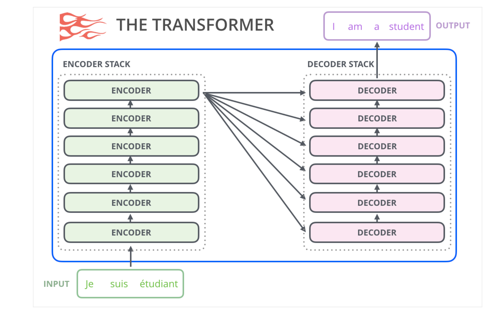

## Our Papers

### Emotion x

- [Emotional chatting machine: Emotional conversation generation with internal and external memory](https://scholar.google.com/citations?view_op=view_citation&hl=en&user=P1jPSzMAAAAJ&citation_for_view=P1jPSzMAAAAJ:fPk4N6BV_jEC)
  - questions:
    how the emotion embedding work - external and internal memory REVIEW
  - #### key concepts:

    - gated recurrent units
    - RNN - A recurrent neural network (RNN) is one of the two broad types of artificial neural network, characterized by direction of the flow of information between its layers
    - LSTM -
    - Bi-LSTM (Bidirectional Long Short-Term Memory) is a type of recurrent neural network (RNN) that processes sequential data in both forward and backward directions. It combines the power of LSTM with bidirectional processing, allowing the model to capture both past and future context of the input sequence.
    - Stochastic gradient descent (SGD) algorithm
      with mini-batch.

### Empathy

- ### [Cem: Commonsense-aware empathetic response generation](https://scholar.google.com/citations?view_op=view_citation&hl=en&user=EaOudNsAAAAJ&citation_for_view=EaOudNsAAAAJ:u-x6o8ySG0sC)

  - Chatting Machine (CEM) to demonstrate how leveraging commonsense knowledge could benefit the understanding of the user’s situation and feelings, which leads to more informative and empathetic responses

  **key concepts:**

  * ATOMIC - xEffect, , xIntent, xNeed, xWant,  (Cognitive Enconder ) , xReact ( Affective Encoder )
  * Affective empathy enables us to experience the emotion of others through various emotional stimuli
  * Cognitive empathy enables us to understand the situations and implicit mental states of others
  * Transformer as base model, PyTorch
- ### [CASE: Aligning Coarse-to-Fine Cognition and Affection for Empathetic Response Generation](https://scholar.google.com/citations?view_op=view_citation&hl=en&user=y58dUQgAAAAJ&sortby=pubdate&citation_for_view=y58dUQgAAAAJ:9yKSN-GCB0IC)
- - Cognition and Affection for reSponding Empathetically (CASE)
  - Empathetic conversation is the alignment and interaction between the cognition
    and affection of empathy
  - CASE contains three
    stages:
    - (1) The graph encoding stage constructs and encodes heterogeneous commonsense cognition graph GCS and emotional concept graph GEC from the dialogue context X.
    - (2) The coarse-to-fine alignment aligns coarse-grained (between contextual cognition and contextual emotional state) and fine-grained (between each specific cognition and corresponding emotional reaction) cognition and affection adopting MIM.
    - (3) The empathy-aware decoder integrates the aligned cognition and affection to generate the response Y = [y1, y2, . . . , yM] with empathetic and informative expressions.

  **key concepts:**

  * Common-sense knowledge infers the user’s situation as cognition and infers emotional reactions to the situation,  which are implied in the dialogue.
  * Concept knowledge serves to extract the emotional state manifested in the dialogue\\\
  * two-level strategy to align cognition and affection using mutual information maximiza-
    tion (MIM)
  * sentence-level commonsense knowledge from COMET
  * word-level concept knowledge from ConceptNet
  * multi-head attention mechanism (MHA)
  * Perplexity of a probability distribution PPL

### Emotional Support

- [Towards emotional support dialog systems](https://scholar.google.com/citations?view_op=view_citation&hl=en&user=EaOudNsAAAAJ&citation_for_view=EaOudNsAAAAJ:u5HHmVD_uO8C)

  - We construct an Emotion Support Conversation dataset (ESConv) with rich annotation (especially support strategy) in a help-seeker and supporter mode
  - It  define the task of Emotional Support Conversation and present an ESC Framework.
    The ESC Framework is adapted from the Helping Skills Theory into a dialog system setting, which
    characterizes three stages with corresponding support strategies useful at each stage.
  - Then construct an Emotional Support Conversation dataset,
    ESConv.
  - Carefully design the process of data collection and devise multiple mechanisms to en-sure the effectiveness of ES in conversations.
  - Finally, we evaluate the ES ability with state-of-the-art dialog models. ( fine tunning some models )
  - Experimental results show thepotential utility of ESConv in terms of improving dialog systems’ ability to provide effective ES.
  - #### Key concepts
  - Emotional support (ES) aims at reducing individuals’ emotional distress and helping them understand and work through the challenges that they face
  - If the supporter only comforts the help-seeker without any inspiration for action to
    change, the supporter may not effectively help
  - Effective ES
    - 1) naturally requires expressing empathy according to the help-seeker’s experiences and
         feelings
    - 2) emotional support conversation needs to explore the users’ problems and
         help them cope with difficulty.
  - 
- [AugESC: Dialogue augmentation with large language models for emotional support conversation](https://scholar.google.com/citations?view_op=view_citation&hl=en&user=EaOudNsAAAAJ&citation_for_view=EaOudNsAAAAJ:Tyk-4Ss8FVUC)

  - Leverage large language models for dialogue augmentation in the task of emotional support conversation (ESC)
  - #### key concepts

    - treats dialogue augmentation as a dialogue completion task
    - 1) fine-tune the 6B GPT-J model (Wang and Komatsuzaki, 2021) with ESConv samples,
      2) prompt it to complete full dialogues on various topics using the dialogue posts of EmpatheticDialogues (Rashkin et al., 2019)
      3) postprocess augmented
         dialogues based on heuristics
      4) thus construct AUGESC, an augmented dataset for the ESC task , which is 45x the scale of the crowdsourced ESConv corpus and largely extends the latter’s topic coverage
- [PAL: Persona-Augmented Emotional Support Conversation Generation](https://scholar.google.com/citations?view_op=view_citation&hl=en&user=EaOudNsAAAAJ&citation_for_view=EaOudNsAAAAJ:UeHWp8X0CEIC)

  - In this paper, the empirical analysis verifies that persona has an important impact on emotional support. Therefore, they propose a framework for dynamically inferring and modeling seekers’ persona
  - First train a model for inferring the seeker’s persona from the conversation history.  Accordingly, they propose PAL, a model that leverages persona information and, in conjunction with their strategybased controllable generation method, provides personalized emotional support.
  - #### Key Concepts

    - is intuitive to explore seekers' personas and build systems for providing personalized emotional support
    - PAL - Persona-Augmented EmotionaL Support
    - extract persona information about the seeker based on the conversation history
    - design an attention mechanism to enhance the understanding of the seeker.
    - propose a strategy-based controllable generation method to actively incorporate persona information in responses for a better rapport with the user
    - 
    - fine-tune a bart-large-cnn1 to augment the ESConv (Liu et al., 2021) dataset with the inferred persona information annotations for each turn of the conversations
    - EVALUATION NOTES :
      - strategy prediction accuracy (ACC),
        perplexity (PPL),
      - BLEU-n (B-n) (Papineni et al.,
        2002),
      - Distinct-n (D-n) (Li et al., 2016a), EAD-n
        (E-n) (Liu et al., 2022), Rouge-L (R-L) (Lin, 2004)
- [Facilitating Multi-turn Emotional Support Conversation with Positive Emotion Elicitation: A Reinforcement Learning Approach](https://scholar.google.com/citations?view_op=view_citation&hl=en&user=y58dUQgAAAAJ&sortby=pubdate&citation_for_view=y58dUQgAAAAJ:0EnyYjriUFMC)

  - SUPPORTER a mixture-of-expert-based reinforcement learning model, and well design ES and dialogue co-
    herence rewards to guide policy’s learning for responding.
  - #### Key concepts
  - multi-turn ESC with positive emotion elicitation
    - 1) in a realistic multi-turn ESC, the user’s emotions often transit towards positive with fluctuation which requires the agent to equip with the mechanism dealing with complex situations to respond satisfactorily
      2) ES response requires a delicate balance between empathy and elicitation. Only empathizing without eliciting falls into a negative emotional cycle, while the opposite setting brings a sense of distance in communication. They needs to be progressively and purposefully adjusted in ongoing interactions
      3) For language expression, the ES response purposefully elicits positive emotions but should not undermine general conversational goals like coherence
  - mixture-of-expert(MoE)
  - dialogue coherence rewards, elicits positive emotion during responding while maintaining dialogue coherence
  - Emotion Experts To track possible transitions of user’s emotional states, emotion experts are associated with contextual and future user emotion predictions.
  - Keyword Experts To meet the need for dialogue coherence, keyword experts are associated with keyword predictions that act on maintaining coherence with contextual and future utterances.

###### 

Mental Health

- [A Chatbot for Mental Health Support: Exploring the Impact of Emohaa on Reducing Mental Distress in China](https://scholar.google.com/citations?view_op=view_citation&hl=en&user=EaOudNsAAAAJ&citation_for_view=EaOudNsAAAAJ:2osOgNQ5qMEC)
  - Emohaa, a conversational agent that provides cognitive support through CBT-Bot exercises and guided conversations.
  - It also emotionally supports users through ES-Bot, enabling them to vent their emotional problems.
    In this study, we analyze the effectiveness of Emohaa in reducing symptoms of
    mental distress.
  - 1) A template-based platform that contains conversations with pre-defined options and exercises that assist participants in improving their mental distress based on CBT principles (CBT-Bot).

       
  - 2) A generative dialogue platform that allows conversations regarding various emotional issues in an open-ended manner (i.e., without requiring the users to choose predefined
       conversational options) and provides emotional support (ES-Bot)

       
  - #### Key concepts
  - CBT - Cognitive Behavioral Therapy
  - Cognitive support enables individuals to reassess their situation from a different perspective and realize a new way of thinking about their problem
  - emotional support includes providing validation and understanding to cause relief and improve emotional distress
  - PHQ-9 is a 9-item self-
    report questionnaire that measures the frequency and severity of
    depressive symptoms over the last two weeks
  - Generalized Anxiety Disorder (GAD-7) scale - a 7-item questionnaire assessing the frequency and severity of symptoms, thoughts, and related behaviors to anxiety within the last two weeks
  - ISI - 7-item Insomnia Severity Index - This questionnaire assesses the severity of sleep-onset and maintenance difficulties, their interference with daily functioning, and the degree of distress caused by sleep problems.
  - participants were encouraged to talk about two main types of emotional experiences and problems: Event-based and  Emotion-based.
  - last observation forward (LOCF)
  - The main problems that participants wanted to talk about were 工作
    环境 (Work environment), 工作压力 (Work pressure), 浪费时间 (Wasting Time), 集中注意力 (Keeping focus), 牲休息时 (Sacrificing leisure time), and 转移注意力 (Diverted attention)
- [Task-Adaptive Tokenization: Enhancing Long-Form Text Generation Efficacy in Mental Health and Beyond](https://scholar.google.com/citations?view_op=view_citation&hl=en&user=EaOudNsAAAAJ&citation_for_view=EaOudNsAAAAJ:eQOLeE2rZwMC)
  - A task-adaptive tokenization as a way to adapt the generation pipeline to the specifics of a downstream task and enhance long-form generation in mental health.
  - introduce a strategy for building a specialized vocabulary and introduce a vocabulary merging protocol that allows for the integration of task-specific tokens into the pre-trained model’s tokenization step.
  - 1) Building on insights from cognitive linguistics we advocate for using task-specific data and the developing variable segmentation for a downstream vocabulary as a pre-step for creating a task-adaptive tokenizer.
    2) Construct a protocol for merging task-specific and pre-trained vocabularies, allowing for fine-tuning inputs to be sampled from multiple tokenization results.
    3) Propose a simple yet effective initialization mechanism to alleviate the difficulty
       of learning representations for new tokens unseen during pre-training.
    4) Demonstrated the efficiency and improved long-form quality of generation for the domain of mental health, where specifically addressed the task of psychological question answering.
    5) Demonstrated the ability of task-adaptive tokenization to enhance both the effectiveness and efficiency of long-form generation.
  - #### key concepts

    - PsyQA task - generate a supportive response to the help-seeker via responding to their post,
    - A custom vocabulary informed by the task at hand is needed to achieve the best optimization potential.
    - Task-adaptive Tokenization
      - 1) we compile a task-specific vocabulary by leveraging a subword regularization algorithm.
        2) merge the task-specific vocabulary with the original vocabulary from pre-trained models
        3) create new token embeddings by mapping the new token to the sub-words in the pre-trained vocabulary and averaging the sub-word embeddings
    - Subword regularization optimizes the likelihood of the training corpus on all possible text
      segmentations and produces a vocabulary that consists of a set of tokens and their corresponding
      log-likelihood scores
    - Bleu is calculated by averaging B-1,2,3,4, where B-n denotes the Bleu n-
      gram precision.
    - R-L is RougeL score.
    - +pct denotes he percentage of improving scores corresponding to Bleu and RougeL over the base.
- [Psyqa: A chinese dataset for generating long counseling text for mental health support](https://scholar.google.com/citations?view_op=view_citation&hl=en&user=2OjUAPUAAAAJ&citation_for_view=2OjUAPUAAAAJ:qjMakFHDy7sC)
  - PsyQA, a Chinese dataset of psychological health support in the form of question and answer pair. PsyQA is crawled from a Chinese mental health service platform, and contains 22K questions and 56K long and well-
    structured answers.
  - Based on the psychological counseling theories, they annotate a portion
    of answer texts with typical strategies for providing support, and further present in-depth
    analysis of both lexical features and strategy patterns in the counseling answers.
  - present a high-quality Chinese dataset of psychological health support (PsyQA) and annotate
    strategies in a portion of answers based on the Helping Skills System.
  - show that there are typical lexical features different support strategies,and explicit patterns of strategy organization and utilization in forming counseling answers.
  - #### key concepts

    - ###### 
    - this work primarily concerns linguistic behavior for counseling, NLP for mental health detection
      and therapy, and text-based mental health-related datasets.

### Theory of Mind

- [Coke: A cognitive knowledge graph for machine theory of mind](https://scholar.google.com/citations?view_op=view_citation&hl=en&user=EaOudNsAAAAJ&citation_for_view=EaOudNsAAAAJ:IjCSPb-OGe4C)
  - COKE formalizes ToM as a collection of 45k+ manually verified cognitive chains that characterize human mental activities and subsequent behavioral/affective responses when facing specific social circumstances. In addition, we further generalize COKE using LLMs and build a powerful generation model COLM tailored for cognitive reasoning.
  - #### Key Concepts

    - ToM - Theory of Mind refers to humans’ ability to understand and infer the desires, beliefs,
      and intentions of others.
    - instantiate ToM as a series of cognitive chains to describe human mental activities and
      behavioral/affective responses in social situations.
    - By integrating COKE into LLMs, they gain the ability to comprehend and predict human cognitive processes with greater depth.
    - Based on COKE, we build a powerful cognitive language model COLM
    - COLM can handle unseen situations and predict complete cog-
      nitive chains in a pipeline manner.
    - cognitive chain involves five types of nodes:
      - 1) situations denote the social circumstances;
        2) clues denote the trigger factors;
        3) thoughts denote the mental activities;
        4) actions denote the behavioral responses;
        5) emotions denote the affective responses.
    - First prompt LLMs using situations to generate thoughts, and then prompt LLMs using
      thoughts to generate clues
    - Clues in COKE denote the trigger factors that direct and concretize the cognitive process.
    - Actions and emotions in COKE denote the behavioral and affective responses to situations after spe-
      cific thoughts
    - COKE delineates ToM concepts and structures them as a cognitive chain:
      - #### Situation ⇒ Clue ⇒ Thought ⇒ (Action+ Emotion).
    - first decompose the cognitive process into a sequence of cognitive generation tasks, and then finetune LLaMA-2 (Touvron et al., 2023) using the collected data from COKE.
    - 

    1) Clue Generation. When facing a specific situation, humans can automatically distinguish the factors that may influence beliefs and trigger thoughts.
    2) Thought Generation. In a specific situation, the related clues trigger and arousediversified human mental activities, i.e., thoughts.
    3) Action Generation. Driven by specific thoughts, we humans will take corresponding actions to realize our beliefs and achieve our goals. Notice that we omit clues here since their impacts are largely covered by the triggered thoughts.
    4) Emotion Generation. After forming a specific thought in a certain situation, humans will naturally generate corresponding emotions to express attitudes and views on the situation. Since emotions are limited to 6 categories, this task is a classification task.
- [ToMBench: Benchmarking Theory of Mind in Large Language Models](https://scholar.google.com/citations?view_op=view_citation&hl=en&user=KzPXllsAAAAJ&sortby=pubdate&citation_for_view=KzPXllsAAAAJ:0EnyYjriUFMC)
  - Theory of Mind (ToM) is the cognitive capability to perceive and ascribe mental states to oneself and others
  - T MBENCH with three key characteristics: a systematic evaluation framework encompassing 8 tasks and 31 abilities in social cognition, a multiple-choice question format to support automated and unbiased evaluation, and a build-from-scratch bilingual inventory to strictly avoid data leakage.
  - #### Key Concepts

    - Theory of Mind (ToM) is the cognitive capability to perceive and ascribe mental states to oneself and others
    - ToM may have spontaneously emerged in LLMs, later studies reveal that LLMs’ ToM performance dramatically decreases when faced with trivial alterations
    - denoting that LLMs rely on unexpected spurious correlations, rather than truly possessing a “Mind Reading” ability.
    - 
    - the GPT-4 series outperforms other LLMs across ToM tasks and abilities, yet their average performance is significantly lower than human levels by over 10% points
    - the first systematic ToM benchmark for LLMs with an MCQ-type inventory entirely built from scratch
    - reveal that even the most advanced LLMs significantly lag behind human performance in ToM.
    - provide an effective and efficient platform for evaluating the ToM capabilities of LLMs and spur further research into LLMs that innately understand ToM, thereby improving how artificial intelligence can serve us in a human-friendly way.

### Others

- [Characterglm: Customizing chinese conversational ai characters with large language models](https://scholar.google.com/citations?view_op=view_citation&hl=en&user=EaOudNsAAAAJ&citation_for_view=EaOudNsAAAAJ:YsMSGLbcyi4C)
  - CharacterGLM, a series of models built upon ChatGLM, with model sizes ranging from 6B to 66B parameters
  - CharacterGLM is designed for generating Character-based Dialogues (CharacterDial), which aims
    to equip a conversational AI system with character customization for satisfying people’s inherent social desires and emotional needs.
  - CharacterGLM, we can customize various AI characters or social agents by configuring their:
  - 1) attributes (identities, interests, viewpoints, experiences, achievements, social relationships, etc.
    2) behaviors (linguistic features, emotional expressions, interaction patterns, etc.)
  - #### Key Concepts

    - the feeling of love and belonging
      serves as a vital need for humans, which could be fulfilled by conversational engagement with desired social entities
    - new task named Character-based Dialogue (CharacterDial)
    - character-based dialogue can be viewed as an extension of persona-based dialogue, presenting a more comprehensive task setting.##### 
    - The development of conversational AI characters centers on creating a virtual conversational partner that is realistic, trustworthy, and engaging
    - the effectiveness of character-based dialogue from three aspects:

      - 1) the degree to which conversational expressions adhere to human traits (consistency),
        2) the naturalness of the conversational style in reflecting human-human interactions (human-likeness),
        3) the extent to which the dialogue can attract and engage users (engagement).
    - Humans are multifaceted beings with various attributes that represent static or gradually evolving features
    - 
    - Training LLMs for Character-Based Dialogue Generation

      - 1) Character Prompt Design - workers formalize character profiles into fluent natural language descriptions, which serve as character prompts for model training.        They  employed data augmentation methods including summarization,
           paraphrasing, and stylization, utilizing Claude-2
        2) Supervised Fine-tuning - utilize ChatGLM of varying sizes as our backbone model, with parameters ranging from 6B to 66B. The character prompt is concatenated with the dialogue for fine-tuning
        3) Self Refinement - collect human-prototype interaction data after models are deployed,  Subsequently, involve the interaction data in the supervised fine-tuning process, thereby facilitating continuous self-refinement of the model
      - CharacterGLM-66B demonstrates its ability to consciously promote plot progression, which plays a crucial role in engaging users and maintaining their interest in the conversation.
      - since the GPT series models adopt a more neutral stance, they perform less effectively in contexts requiring more empathetic or emotionally nuanced engagement.
      - Long-term interaction is critical to fostering user engagement and emotional connection with conversational models

## Other important papers

- [A Computational Approach to Understanding Empathy Expressed in Text-Based Mental Health Support](https://scholar.google.com/citations?view_op=view_citation&hl=en&user=AHUNnG0AAAAJ&sortby=pubdate&citation_for_view=AHUNnG0AAAAJ:UebtZRa9Y70C)

  - present a computational approach to understanding how empathy is expressed in online mental health platforms
  - develop a novel unifying theoretically-grounded framework for characterizing the communication
    of empathy in text-based conversations
  - collect and share a corpus of 10k (post, response) pairs annotated using this empathy
    framework with supporting evidence for annotations (rationales).
  - develop a multi-task RoBERTa-based bi-encoder model for identifying empathy in conversations and extracting rationales underlying its predictions.
  - their approach is aimed towards developing empathy-based feedback and training
    systems for peer supporters (consistent with calls to action for improved treatment access and training
  - #### Key Concepts

    - However, the current understanding of empathy is limited to traditional face-to-face, speech-based therapy
    - key aspect of empathy is to communicate a cognitive understanding of others
    - EPITOME, a conceptual framework for characterizing communication of empathy in conversations that synthesizes and adapts the most prominent empathy scales from speech-based, face-to-face contexts to text-based, asynchronous contexts.
    - ( EmPathy In Text-based, asynchrOnous MEntal health conversations )

      - EPITOME consists in three communication mechanisms of empathy:

        1) Emotional Reactions,
        2) Interpretations,
        3) Explorations
    - RoBERTa-based bi-encoder model for identifying empathy communication mechanisms in conversations
    - Their multi-task model simultaneously extracts the underlying supportive evidences, rationales for its predictions which serve the dual role of

      - 1) explaining the model’s decisions, thus minimizing the risk of deploying harmful technologies in sensitive contexts
      - 2) enabling rationale-augmented feedback for peer supporters enabling rationale-augmented feedback for peer supporters.
    - Two Enconders - the model uses two independently pre-trained transformer encoders from RoBERTaBASE – S-Encoder & R-Encoder – for encoding seeker post and response post respectively. S-Encoder encodes context from the seeker post whereas R-Encoder is responsible for understanding empathy in the response post.
    - 
    - where [CLS] and [SEP] are special start and end
      tokens adapted from BERT (Devlin et al., 2019).
    - 
    - Peer supporters do not self-learn empathy over time.
    - Relationship forming more likely after empathic conversations.
    - Females are more empathic with females than males are with males.
- [Towards Facilitating Empathic Conversations in Online Mental Health Support: A Reinforcement Learning Approach](https://scholar.google.com/citations?view_op=view_citation&hl=en&user=AHUNnG0AAAAJ&sortby=pubdate&citation_for_view=AHUNnG0AAAAJ:hqOjcs7Dif8C)

  - They propose Partner, a deep reinforcement learning (RL) agent that learns to make sentence-level edits to posts in order to increase the expressed level of empathy while maintaining conversation quality
  - The RL agent leverages a policy network, based on a transformer language model adapted from GPT-2, which performs the dual task of generating candidate empathic sentences and adding those sentences at appropriate positions. During training, they reward transformations that increase empathy in posts while maintaining text fluency, context specificity, and diversity.
  - By combining human knowledge of context and experience, our approach can both provide feedback to online peer-supporters with actionable, real-time examples, and provide support seekers with more empathic responses.
  - #### Key conceps

    - task of empathic rewriting requires changes that go beyond simple word-level transformations
    - TalkLife (talklife.co) is the largest online peer-to-peer support platform for mental health support.
    - 
    - In this framework, given a state s ∈ S, an agent takes an action a ∈ A according to t.                      he policy π : S × A → [0, 1].
      The policy defines whether the agent should take action a in a states.  The goal of the reinforcement learning agent is to learn a policy which maximizes the reward r : S × A → R.
    - The use of seeker post helps in leveraging conversational context, thereby enabling transformations that are specific to the feelings and experiences shared in the seeker post. The response post is used for making transformations.
    - the empathy classification model developed by Sharma , is used for predicting empathy levels of responses.
    - Models cheat-list:
      - DialoGPT [75]: A large dialogue generation model, based onGPT-2 [52] and pre-trained on Reddit conversations.
      - MIME [41]: An empathic dialogue generation model which
        exploits emotion mimicking while accounting for emotion
        polarity (positive or negative).
      - Deep latent sequencemodel [22]: Adeep generative model
        designed for unsupervised style transfer.
      - BART [29]: An encoder-decoder model for sequence-to-
        sequence language generation.
    -
- [Human–AI collaboration enables more empathic conversations in text-based peer-to-peer mental health support](https://scholar.google.com/citations?view_op=view_citation&hl=en&user=AHUNnG0AAAAJ&sortby=pubdate&citation_for_view=AHUNnG0AAAAJ:5nxA0vEk-isC)
- [A Computational Framework for Behavioral Assessment of LLM Therapists](https://scholar.google.com/citations?view_op=view_citation&hl=en&user=AHUNnG0AAAAJ&sortby=pubdate&citation_for_view=AHUNnG0AAAAJ:e5wmG9Sq2KIC)

  - they developed HAILEY, an AI-in-the-loop agent that provides just-in-time feedback to help participants who provide support (peer supporters) respond more empathically to those seeking help (support seekers).
  - (Human-AI coLlaboration approach for EmpathY)
  - They systematically analyze the Human-AI collaboration patterns and find that peer supporters are able to use the AI feedback both directly and indirectly without becoming overly reliant on AI while reporting improved self-efficacy post-feedback
  - Their findings demonstrate the potential of feedback-driven, AI-in-the-loop writing systems to empower humans in open-ended, social, creative tasks such as empathic conversations.
  - HAILEY, a Human-AI collaboration system that led to a 19.60% increase in empathy in peer-to-peer conversations overall and a 38.88% increase in empathy for mental health
  - a mobile friendliness design is critical for the adoption of conversational assistive
    agents like ours.
  - #### Key Concepts

    - Empathy is the ability to understand and relate to the emotions and experiences of others and to effectively communicate that understanding
    - Empathic support is one of the critical factors that contributes to successful conversations in mental health support, showing strong correlations with symptom improvement and the formation of alliance and rapport
    - HAILEY ensure actionability by guiding peer supporters with concrete steps they may take to respond with more empathy,
    - build on PARTNER by further improving training data quality through additional filtering, supporting
      multiple generations for the real-world use-case of multiple types of feedback for the same post, and evaluating a broader range of hyperparameter choices.
    - 
- [IMBUE: Improving Interpersonal Effectiveness through Simulation and Just-in-time Feedback with Human-Language Model Interaction](https://scholar.google.com/citations?view_op=view_citation&hl=en&user=AHUNnG0AAAAJ&sortby=pubdate&citation_for_view=AHUNnG0AAAAJ:_Qo2XoVZTnwC)

  - They conduct a human-centered study that uses language models to simulate bespoke communication training and provide just-in-time feedback to support the practice and learning of interpersonal effectiveness skills.
  - IMBUE is the first to focus on communication skills and emotion management simultaneously, incorporate experts’ domain knowledge in providing feedback, and be grounded in psychology theory
  - To successfully communicate during challenging situations, it is crucial to focus not only on communication skills, but also on managing emotions.
  - 1) they collected a dataset from crowdworkers consisting of difficult situations they encounter and simulated conversations within them (the crowdworker being paired with a role-playing LM partner. We then ask psychology experts specifically trained in teaching DBT skills to annotate these conversations, assessing skill use and offering suggestions for improvemente
    2) they developed a computational methods to provide feedback using insights from the formative study and collected a dataset.  Also the team proposed a new prompting strategy, demonstrating contrasting pairs of strong and weak utterances, in addition to state-of-the-art prompting methods
    3) build IMBUE, an interactive training system that simulates difficult conversations and provide just-in-time feedback backed by LMs to support the practice and learning of DEAR MAN skills
  - 
  - #### KeyConcepts

    - Dialectical Behavioral Therapy (DBT)
    - DEAR MEN - Describe | Express | Assert | Reinforce | stay Mindful | Appear confidet |  Negotiate
      - (Describe, Express, Assert, Reinforce, and Negotiate) - includes conversational strategies
      - and a desired “state of mind” (Mindful and Confident) for productive conversations.
      - 
    - DBSCAN - to cluster feedback on weak ratings and where a skill should be applied but was not.
    - skill rating and improvements suggestions :
      - 1) curated rubrics to augment the LMs with experts’ insights
           in DEARMEN dataset
        2) a reasoning step for both demonstrations and generation to facilitate skill rating,
        3) kNN retrieval of few-shot demonstrations from the expert annotated data in DEARMEN dataset, and contrasting pair demonstrations to help LMs learn nuanced concepts.
    - kNN demonstrations:
      1) encode all utterances using the all-mpnet-base-v2 model with SentenceTransformer. For each query utterance, we use faiss (Douze et al., 2024) to retrieve the k most similar examples from each level (strong, weak, none) for this skill in our datasets
    - Contrasting pair demonstrations:
    - 1) construct pairs of (strong, weak) and (strong, none) demonstrations
      2) search for the k weak and none examples that are most relevant to the
         query utterance.
      3) use the expert rewritten responses as strong examples to form the contrasting pairs, and use these pairs as demonstrations which helps the model learn nuanced concepts and disentangle multiple skills
    - Next Skill Suggestion
      - skill is considered “recommended” if:
        - 1) is selected by the participant and the expert does not advise against it, or
          2) is not selected but is suggested by the expert.
      - retrieve the most similar examples to situation , to prompt GPT-4 and generate the suggested skill.
    - The skill mastery can be acquired from practicing with a different situation, while emotion reduction and self-efficacy appear to only benefit from training specifically on the situation.

  ---
- [ATOMIC: An Atlas of Machine Commonsense for If-Then Reasoning](https://arxiv.org/pdf/1811.00146)

  - ATOMIC - ATlas Of MachIne Commonsensessss

    - an atlas of everyday commonsense reasoning, organized through 877k textual descriptions of inferential knowledge
    - Focuses on inferential knowledge organized as typed if-then relations with variables
    - They propose propose nine if-then relation types to distinguish causes vs. effects, agents vs. themes, voluntary vs. involuntary events, and actions vs. mental states
    - Show that neural models can acquire simple commonsense capabilities and reason about previously unseen events
    - So ATOMIC consists:

      1) of over 300k events associated with 877k inferential relations, making it the largest knowledge graph of its kind.
      2) A crowdsourcing framework gathers annotations in the form of free-form textual responses to simple questions which enables large-scale high quality collection of commonsense about events
      3) The crowdsourcing framework that gathers annotations in the form of free-form textual responses to simple questions which enables large-scale high quality collection of commonsense about events
      4) 
  - #### Key Concepts:

    - AI systems are trained for task-specific datasets and objectives, which lead to models that
      are effective at finding task-specific correlations but lack simple and explainable commonsense reasoning
    - Contrary to most previous work, ATOMIC also characterizes knowledge of events and
      their implied participants
    - Amazon Mechanical Turk (MTurk) for gathering common-
      sense annotations
    - They frame the problem as a conditional sequence generation problem:
      - given an event phrase e and an inference dimension c, the model generates the target t = fθ(e, c). Specifically, we explore various multitask encoder-decoder setups.
        - Encoder -
        - Decoder .
        - 
        - 
        - EVENT2(IN)VOLUNTARY: We explore grouping dimensions together depending on whether they denote voluntary (e.g., xIntent, oWant) or involuntary (e.g., xReact,
          oEffect) events. This model has one encoder for four “voluntary” decoders, as well as another encoder for five “involuntary” decoders.
        -
- [COMET: Commonsense Transformers for Automatic Knowledge Graph Construction](https://arxiv.org/abs/1906.05317)

  

  - the first comprehensive study on automatic knowledge base construction for two prevalent commonsense knowledge graphs: ATOMIC (Sap et al., 2019) and ConceptNet (Speer et al., 2017).
  - important step toward automatic commonsense completion is the development of generative models of commonsense knowledge, and propose COMmonsEnse Transformers (COMET ) that learn to generate rich and diverse commonsense descriptions in natural language
  - COMET is a framework for adapting the weights of language models to learn to produce novel and diverse commonsense knowledge tuples.
  - Empirical results on two commonsense knowledge bases, ATOMIC and ConceptNet, show that COMET frequently produces novel commonsense knowledge that human evaluators deem to be correct.
  - 
  - #### Key Concepts

    commonsense knowledge base (KB)

    Automatic KB construction is a long-standing goal of artificial intelligence research due to the difficulty of achieving high concept coverage in high-precision curated KBs

    COMET is an adaptation framework for constructing commonsense knowledge bases from language models by training the language model on a seed set of knowledge tuples.

    These tuples provide COMET with the KB structure and relations that must be learned, and COMET learns to adapt the language model representations learned from pretraining to add novel nodes and edges to the seed knowledge graph.

    a ConceptNet tuple relating to “taking a nap" would be: (s=“take a nap", r=Causes, o=“have energy"). The task is to generate o given s and r as inputs.

    They use the transformer language model architecture introduced in Radford - (GPT), which uses multiple transformer blocks of multi-headed scaled dot product attention and fully connected layers to encode input text

    

    MULTIATTN is a multi-headed selfattention mechanism

    FFN is a two-layer feed-forward network

    LAYERNORM represents a layer normalization

    

    COMET exceeds the performance of all baselines, achieving a 51% relative improvement over the top performing model of Sap et al. (2019)

    The results indicate that even with only 10% of the available training data, the model is still able to

    ## Tutorials
  - GPT (https://jalammar.github.io/illustrated-gpt2/)

    - a language model is – basically a machine learning model that is able to look at part of a sentence and predict the next word.
    - The most famous language models are smartphone keyboards that suggest the next word based on what you’ve currently typed.
    - 
    - 
    - 
    - 
    - 
- - Finetuning models (https://towardsdatascience.com/rick-and-morty-story-generation-with-gpt2-using-transformers-and-streamlit-in-57-lines-of-code-8f81a8f92692)
