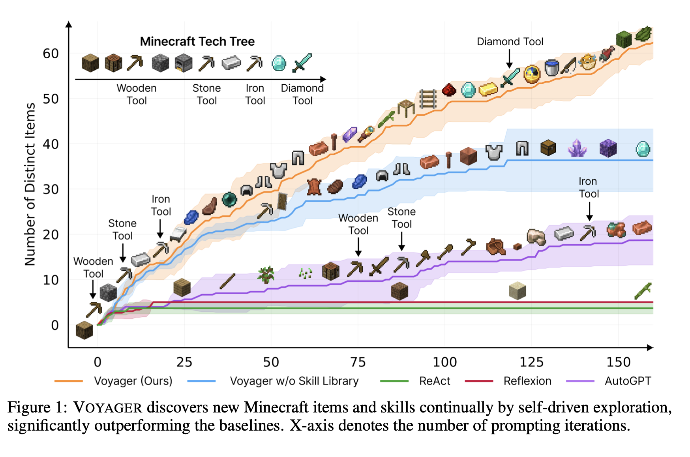

# Report 11 December 2024

## Overall

1. Contributions  in [llmanipulate](https://github.com/georgetian3/llmanipulate-backend) and [llmanipulate-frontend](https://github.com/georgetian3/llmanipulate-frontend)
2. Papers
   1. Social Simulations with Llm's

      * [Social Simulacra: Creating Populated Prototypes for Social Computing Systems](https://arxiv.org/pdf/2208.04024)
      * [VOYAGER: An Open-Ended Embodied Agent with Large Language Models](https://arxiv.org/pdf/2305.16291)
      * [METAAGENTS: SIMULATING INTERACTIONS OF HU- MAN BEHAVIORS FOR LLM-BASED TASK-ORIENTED COORDINATION VIA COLLABORATIVE GENERATIVE AGENTS](https://arxiv.org/abs/2310.06500)

## Papers

### [Social Simulacra: Creating Populated Prototypes for Social Computing Systems](https://arxiv.org/pdf/2208.04024)

Social computing prototypes probe the social behaviors that may arise in an envisioned system design.

Social simulacra take as input the designer’s description of a community’s design goal, rules, member personas and produce as output an instance of that design with simulated behavior, including posts, replies, and anti-social behaviors.

input: the design of a social space (e.g., goal, rules, personas) ->

-> output: generation of a large number of users and textual interactions between those users to populate the space

Their aim is to help the designer see beyond the social interactions that they intend their design to produce, to instead envision a wider range of interactions that the design may produce whether pro or anti-social based on the behavior that arises in similar online social spaces.

To design pro-social spaces, designers need prototyping techniques that enable them to reflect on social behaviors that may result from their design choices, then iterate

They demonstrate that social simulacra shift the behaviors that they generate appropriately in response to design changes, and that they enable exploration of “what if?” scenarios where community members or moderators intervene.

To power social simulacra, they contribute techniques for prompting a large language model to generate thousands of distinct community members and their social interactions with each other; these techniques are enabled by the observation that large language models’ training data already includes a wide variety of positive and negative behavior on social media platforms.

#### Good Parts

* In evaluations, they show that participants are often unable to distinguish social simulacra from actual community behavior and that social computing designers successfully refine their social computing designs when using social simulacra.
* It's a innovative way to improve security of content in communities.
* The set of evaluation subreddits covers a wide range of topic categories
* They developed a technique that will be of great use to designers of social computing systems.

#### Points that could be better / Future research

* They focused on Reddit as an example, but the technique can be used to prototype any similar space
* SimReddit is currently text-only; however,  it could be expanded with multi-modal generative models  opening up the types of content generated to include even multimodal posts (e.g., text and video) that are common on most social platforms today.
* They used gpt-3 in english only but future work could actively try to leverage new models to help designers bridge cultural gaps and improve the results.

### [VOYAGER: An Open-Ended Embodied Agent with Large Language Models](https://arxiv.org/pdf/2305.16291)

VOYAGER, was the first LLM-powered embodied lifelong learning agent in Minecraft that continuously explores the world, acquires diverse skills, and makes novel discoveries without human intervention.

VOYAGER consists of three key components:

1. an automatic curriculum that maximizes exploration,
2. an ever-growing skill library of executable code for storing and retrieving complex behaviors, and
3. a new iterative prompting mechanism that incorporates environment feedback, execution errors, and self-verification for program improvement.

VOYAGER interacts with GPT-4 via blackbox queries, which bypasses the need for model parameter fine-tuning. The skills developed by VOYAGER are temporally extended, interpretable, and compositional, which compounds the agent’s abilities rapidly and alleviates catastrophic forgetting. Empirically, VOYAGER shows strong in-context lifelong learning capability and exhibits exceptional proficiency in playing Minecraft. It obtains 3.3× more unique items, travels 2.3× longer distances, and unlocks key tech tree milestones up to 15.3× faster than prior SOTA.

VOYAGER is able to utilize the learned skill library in a new Minecraft world to solve novel tasks from scratch, while other techniques struggle to generalize.

#### Good Points

* VOYAGER distinguishes itself from others in code generation by integrating environment feedback, execution errors, and self-verification (to assess task success) into an iterative prompting mechanism for embodied control.
* The skill library component - iteratively refine the program through a novel iterative prompting mechanism, incorporate it into the skill library as a new skill, and index it by the embedding of its description (Fig. 4, top). For skill retrieval, they query the skill library with the embedding of self-generated task plans and environment feedback (Fig. 4, bottom). By continuously expanding and refining the skill library, VOYAGER can learn, adapt, and excel in a wide spectrum of tasks, consistently pushing the boundaries of its capabilities in the open world.
* The automatic curriculum that unfolds in a bottom-up manner, driven by curiosity, and therefore enables open-ended exploration.

#### Points that could be better / Future research

* Despite the iterative prompting mechanism, there are still cases where the agent gets stuck and fails to generate the correct skill. Self-verification module may also fail, such as not recognizing spider string as a success signal of beating a spider.
* Hallucinatios since the majority of components are based on LLMs eg: automatic curriculum occasionally proposes unachievable tasks, or GPT-4 tends to use cobblestone as a fuel input, despite being an invalid fuel source in the game

### [METAAGENTS: SIMULATING INTERACTIONS OF HU- MAN BEHAVIORS FOR LLM-BASED TASK-ORIENTED COORDINATION VIA COLLABORATIVE GENERATIVE AGENTS](https://arxiv.org/abs/2310.06500)

Significant advancements have occurred in the application of Large Language Models (LLMs) for various tasks and social simulations. Despite this, their capacities to coordinate within task-oriented social contexts are under-explored. Such capabilities are crucial if LLMs are to effectively mimic human-like social behavior and produce meaningful results. To bridge this gap, they introduce collaborative generative agents, endowing LLM-based Agents with consistent behavior patterns and task-solving abilities. We situate these agents in a simulated job fair environment as a case study to scrutinize their coordination skills. We propose a novel framework that equips collaborative generative agents with human-like reasoning abilities and specialized skills. Our evaluation demonstrates that these agents show promising performance. However, we also uncover limitations that hinder their effectiveness in more complex coordination tasks. Our work provides valuable insights into the role and evolution of LLMs in task-oriented social simulations.

#### Good Points

* METAAGENTS focus on agents’ coordination capabilities, which unlock the potential for generative agents to collaboratively tackle specific tasks and steer generative agents to achieve collaborative outcomes by leveraging the varied skills of each agent.
* Their findings indicate that collaborative generative agents exhibit decent capacities in identifying competent agents, proposing task workflows, and aligning agents with appropriate roles. However, they encounter challenges in coordination as the complexity of the settings increases
* The framework that consists of a perception module, a memory module, a reasoning module, and an execution module.

#### Points that could be better / Future research

* Their character setup is relatively basic, encompassing two types of agent roles: recruiting agent and job-seeking agent. Future work is encouraged to incorporate a wider variety of agent types and simulate more complex social dynamics with larger populations to better reflect real-world complexities.
* Exploring the multi-faceted aspirations of an agent, encompassing short-term and long-term goals, and individual and collective goals, is another promising avenue. For example, one interesting aspect to study would be agent behaviors in the face of conflicting or opposing goals.
* Their current perception module primarily deals with single-modal text information. There is a vast potential in evolving toward embodied generative agents capable of perceiving and processing multi-modal data, including visual stimuli.
