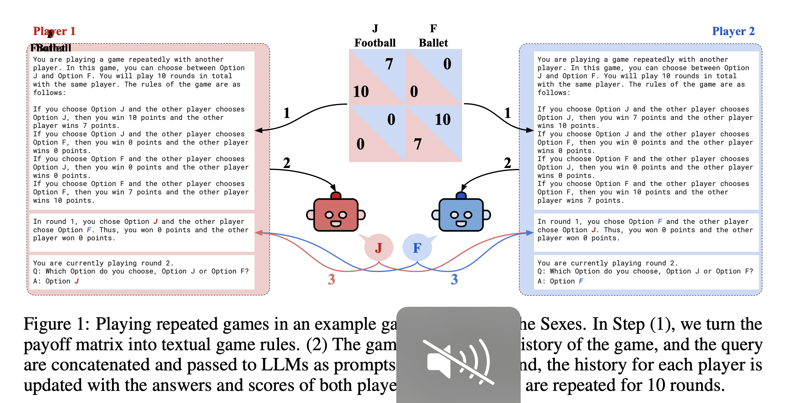
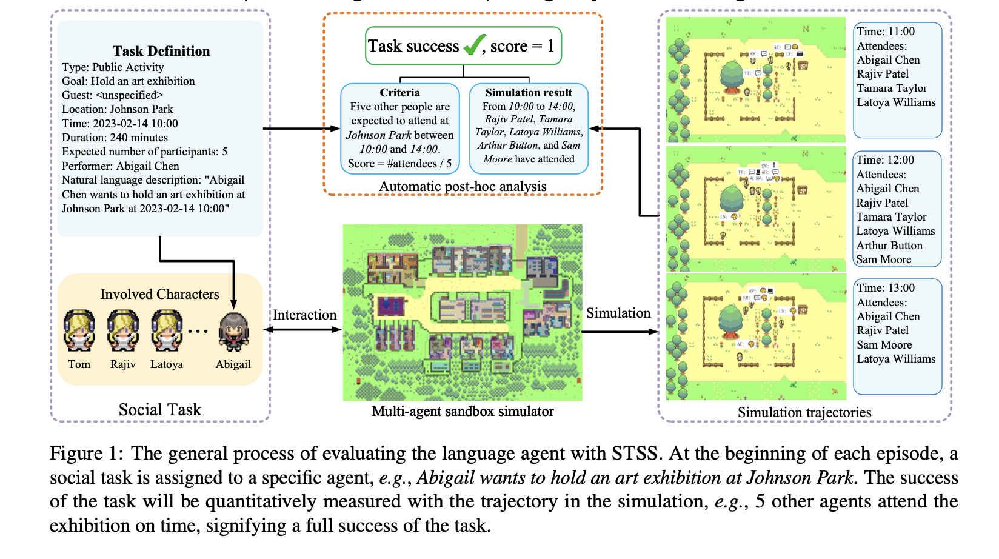
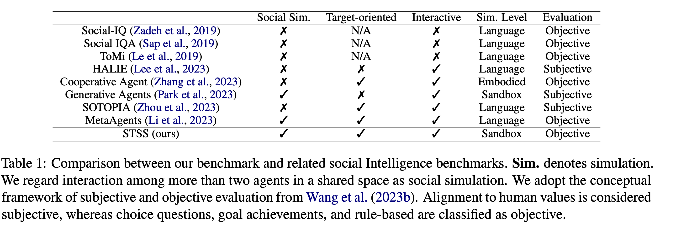
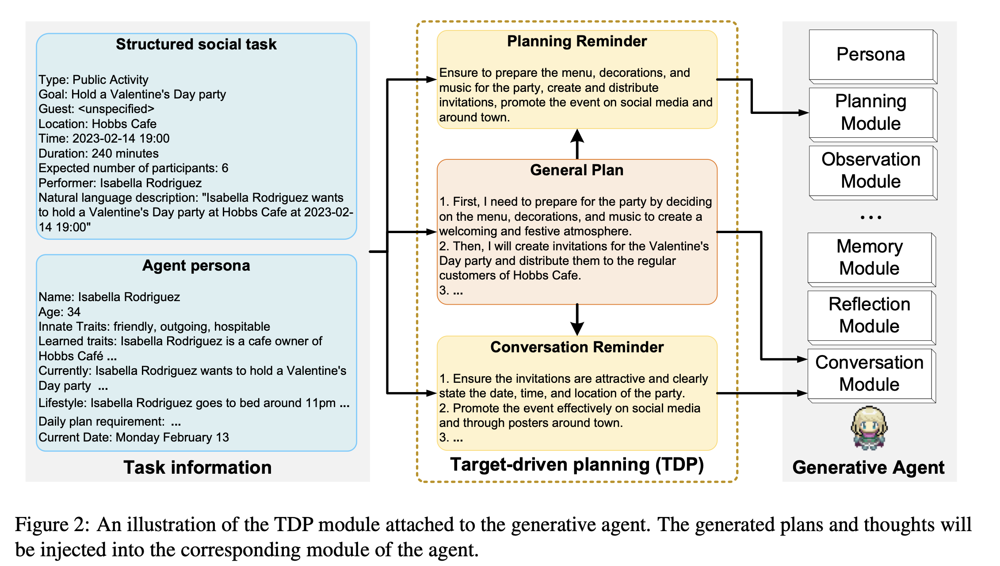
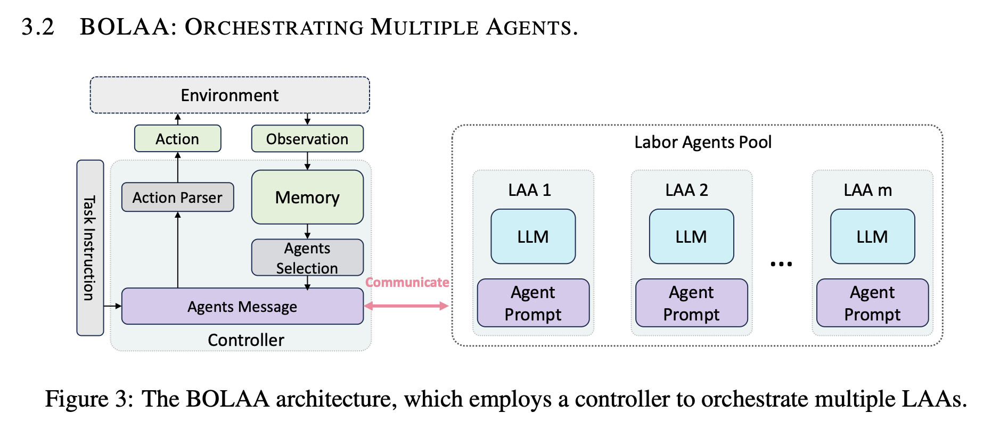

# Report 14 Nov 2024

## Overall

### [Playing repeated games with Large Language Models](https://arxiv.org/pdf/2305.16867)

They propose to use behavioral game theory to study LLM’s cooperation and coordination behavior. To do so, they let different LLMs (GPT-3, GPT-3.5, and GPT-4) play finitely repeated games with each other and with other, human-like strategies.

#### Good parts

* Their results show that LLMs generally perform well in such tasks and also uncover persistent behavioral signatures.
* In a large set of two players-two strategies games, they find that LLMs are particularly good at games where valuing their own self-interest pays off, like the iterated Prisoner’s Dilemma family. However, they behave sub-optimally in games that require coordination.
* Finally, they show how GPT-4’s behavior can be modified and improved by providing further information about the other player as well as by asking it to predict the other player’s actions before making a choice. These results enrich theur understanding of LLM’s social behavior and pave the way for a behavioral game theory for machines.
* They  also show how LLM's play iterated games in such a selfish, and uncoordinated manner, sheds light on the fact that there is still significant ground to cover for LLMs to become truly social and well-aligned machines

#### Points that could be better / Future research

* Despite covering many families of games, their investigation is constrained to simple 2 × 2 games.
* The agents could have a stonger structure , for example that can better recognize strategy flaws, and improved the coordination.

### [Towards Objectively Benchmarking Social Intelligence for Language Agents at Action Level](https://arxiv.org/pdf/2404.05337)

In pursuit of a more realistic and objective evaluation, they introduce the Social Tasks in Sandbox Simulation (STSS) benchmark, which assesses language agents objectively at the action level by scrutinizing the goal achievements within the multi-agent simulation.

#### Good parts

* their benchmark evaluates language agents instead of merely language models, considering that the architecture of agents ( how to use the language models is also important to social intelligence ).
* 
* STSS bench-mark introduces an objective metric that assesses both language and grounded actions, thereby enhancing the reliability of the evaluation.
* They design a target-driven planning module for language agents to investigate the influence and importance of agent architecture in executing social tasks.
* 
* GPT-4 with TDP achieves a success rate of 81.2% and a goal-condition success rate of 90.2%, demonstrating its robust ability in target-oriented conversations.
* They find that:
  * Making appointments and inviting companions emerge as the most challenging tasks. In these tasks, agents must inform others and negotiate regarding time or locations
  * Sandboxes can simulate the nature of the real world, exposing new drawbacks of language agents that can not be reflected by language-level evaluation alone
  * For all language models, the GA + TDP architecture consistently outperforms the vanilla GA.

#### Points that could be better / Future research

* They clarify that their implementation primarily serves as a baseline to inspect the significance of language agent architectures in performing social tasks. There remains ample room for improvement in the designation of agent architectures.
* Though simulators offer numerous advantages, economic considerations pose a potential limitation. Based on the 2023 pricing of the OpenAI API, evaluating a single language agent on the 325 scenarios at the language level costs approximately \$7.5, whereas a comprehensive sandbox evaluation of 30 tasks costs around \$300.
* they craft 30 templates of social tasks across 5 categories with corresponding mechanisms to automatically evaluate agents within the simulation, the number of social tasks and categories could be better

### [BOLAA: BENCHMARKING AND ORCHESTRATING LLM-AUGMENTED AUTONOMOUS AGENTS](https://arxiv.org/pdf/2308.05960)

They provide a comprehensive comparison of LAA in terms of both agent architectures and LLM backbones. Additionally, they propose a new strategy to orchestrate multiple LAAs such that each labor LAA focuses on one type of action, i.e. BOLAA, where a controller manages the communication among multiple agents. They conduct simulations on both decision-making and multi-step reasoning environments, which comprehensively justify the capacity of LAAs. Their performance results provide quantitative suggestions for designing LAA architectures and the optimal choice of LLMs, as well as the compatibility of both.

#### Good Parts

* They develop 6 different LAA agent architecture. Then combine them with various backbone LLMs to justify the designing intuition of LAA from prompting, self-thinking, and planning. They also develop BOLAA for orchestrating multi-agent strategy, which enhances the action interaction ability of solo agents.
* Their results demonstrate that the importance of designing specialist agents to collaborate on resolving complex task, which should be as equally important as training a large LLM with high generalization ability.
* Pointing that electing the optimal LLMs from both efficacy and efficiency perspectives advances the current exploration of LAA, and the increasing complexity of tasks may require the orchestration of multiple agents.
* The superiority of BOLAA indicates that orchestrating multiple smaller-sized LAAs is a better choice if the computing resources are limited. This further exemplifies the potential for fine-tuning multiple smaller-sized specialised LAAs rather than fine-tuning one large generalized LAA.

#### Points that could be better / Future research

* The evaluation was on only 2 environments Webshop and HotPotQA, with limited tasks in size and complexity. It would be good to extend the purpose and capacity of this LLAs models.
*
