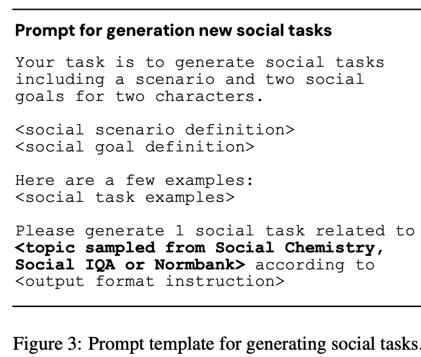

# Report 19 September 2024

## Overall

1. Review last draft notes - https://github.com/Antonio-Moura-Coutinho/Emotional-AI/tree/main
2. Select some papers from https://github.com/Sahandfer/EMPaper
3. Review researh direction
   1. Social intelligence :
      1. emotion support
      2. conflict resolution
      3. simulations
4. Relevant names ( Diyi Yang, Maarten Sap)
5. The Good, The Bad, and Why: Unveiling Emotions in Generative A
6. SOTOPIA: INTERACTIVE EVALUATION FOR SOCIAL INTELLIGENCE IN LANGUAGE AGENTS
7. SOTOPIA-π: Interactive Learning of Socially Intelligent Language Agents
8. PATIENT-Ψ: Using Large Language Models to Simulate Patients for Training Mental Health ProfessionalsPatient phi
9. Social Skill Training with Large Language Models -
10. Rehearsal: Simulating Conflict to Teach Conflict Resolution

## Papers

[The Good, The Bad, and Why: Unveiling Emotions in Generative A](https://https://arxiv.org/pdf/2312.11111)

This paper aims to address this gap by incorporating psychological theories to gain a holistic understanding of emotions in generative AI models. Specifically, we propose three approaches:

1) EmotionPrompt to enhance the performance of the AI model,
2) EmotionAttack to impair the performance of the AI model, and
3) EmotionDecode to explain the effects of emotional stimuli, both benign and malignant.

Demonstrate:

* That both textual and visual EmotionPrompt can boost the performance of AI models
* While EmotionAttack can hinder it. (**to make slow or difficult the progress of**)
* EmotionDecode reveals that AI models can comprehend emotional stimuli similar to the dopamine mechanism in the human brain

Key Concepts:

* Emotion is a multifaceted psychological and physiological phenomenon that encompasses subjective feelings, physiological responses, and behavioral expressions (Lewis et al.2010).
* Emotions manifest themselves through a confluence of reflexes, perception, cognition, and behavior, all of which
  are subject to modulation by a range of internal and external determinants (Salovey et al., 2009; Russell, 2003).
* In decision-making, emotions emerge as powerful, ubiquitous, and consistent influencers that can swing from
  beneficial to detrimental (Lerner et al., 2015)
* By decoding the mean embedding of emotional prompts, we successfully triggered “dopamine”
  inside AI models, which is analogous to dopamine in the human brain that affects performance.
* **Emotion Prompt** - Three theories:

  * self-monitoring - refers to the process by which individuals regulate and control their behavior in response to social situations and the reactions of others (Ickes et al., 2006).
  * Social cognitive theory is commonly used in psychology, education, and communication, which states that learning can be closely related to watching others in social settings (Bandura, 2013).
  * Maslow’s Hierarchy of Needs (McLeod, 2007), which presents a psychological framework, categorizes human needs into a five-tier pyramid.
    * This theory posits that individuals are driven to:
      1. satisfy basic physiological requirements,
      2. safety,
      3. social belonging,
      4. esteem,
      5. self-actualization, in a hierarchical sequence.
    * The fulfillment of needs is associated with the experience of positive emotions and a sense of well-being, including feelings such as satisfaction, comfort, and contentment (McLeod, 2007).
* **Emotional Attack**:

  * was inspired by two classic psychological factors:
    1. Negative life events encompass diverse occurrences in individuals’ daily lives, inducing personal distress, discomfort, and various negative emotions
    2. Emotional arousal that can be described as the degree of subjective activation (experienced as activation versus deactivation) that the observer experiences when viewing a stimulus (Reisenzein, 1994).
* **EmotionDecode**:

  * a computational explanation for Emotion Prompt and EmotionAttack leveraging theories and phenomena from neuroscience, psychology, and computer science.
  * This interpretation is inspired by the brain reward pathways inside the human brain that are responsive to rewards.
  * This pathway is primarily related to the release of neurotransmitters, notably dopamine, a fundamental chemical messenger in the brain.
  * We averaged the embedding of all prompts in EmotionPrompt and EmotionAttack, and then decoded the mean embedding at different layers of the Llama2-13b-Chat model to get the “meta” prompt, which is the representative prompt from “reward area” and “punishment area”.

[SOTOPIA: INTERACTIVE EVALUATION FOR SOCIAL INTELLIGENCE IN LANGUAGE AGENTS](https://https://arxiv.org/pdf/2310.11667)

* SOTOPIA, an open-ended environment to simulate complex social interactions between artificial agents and evaluate their social intelligence.
* In this environment, agents role-play and interact under a wide variety of scenarios; they coordinate, collaborate, exchange, and compete with each other to achieve complex social goals.
* They simulate the role-play interaction between LLM-based agents and humans within this task space and evaluate their performance with a holistic evaluation framework called SOTOPIA-EVAL.
* **Key Concepts:**
  * Agents can use verbal and non-verbal communication together with physical actions
  * diverse task space: the combination of automatically generated scenarios, goals, characters, relationships, and other agents’ policies creates a huge and diverse space of tasks
  * we cannot only consider completing major social goals, as humans’ motives often balance multiple implicit goals, such as maintaining relationships, preserving finances, gaining information, keeping secrets, and following social rules
  * SOTOPIA-EVAL (§3) to evaluate agents using multi-dimensional criteria
  * an environment with the following desidered data:
    1) Realistic: this is to evaluate and understand artificial agents’ behav- ior under realistic scenarios;
    2) Mixed utilities: human motives are often driven by both explicit and implicit incentives, and the environment should be able to evaluate the agents’ performance on multiple dimensions;
    3) Open-ended: to support large-scale simulation and evaluation, the envi- ronment should be able to produce new tasks satisfying the previous two desiderata procedurally, without heavy human intervention.
    4) An N-agent DecPOMDP framework Bernstein et al. (2002); Nair et al. (2003) includes a state space, an action space, an observation space, a transition function, an observation function, and a reward function
    5) Task Space: -
       1) CHARACTERS: - The name, gender, age, occupation, and pronouns are in free text format, while the formats of personality traits, moral values, and personal values are lists of predefined types .

          1) The personality trait types are“openness to experience”, “conscientiousness”, “extraversion”, “agreeableness” and “neuroticism” (Goldberg, 1992).
          2) The moral value types are “care”, “fairness”, “loyalty”, “authority” and “purity” (Cieciuch & Davidov, 2012). The Schwartz personal value types are “self-direction”, “simulation”, “hedonism”, “achievement”, “power”, “security”, “conformity”, “tradition”, “benevolence”, and “universalism” Cieciuch & Davidov (2012).
          3) The decision-making style types are “directive”, “analytical”, “conceptual”, and “behavioral”
       2) RELATIONSHIPS: - To generate relationships, except for strangers, they randomly sampled 90 pairs of characters and prompted GPT-4 with their relationships (family, friend, romantic, and acquaintance) (( Future research could explore the methods to generate realistic relationships within human communities. ))
       3) SCENARIOS: - To generate scenarios, we propose two methods to generate the scenario context and social goals.

          1) The first method is first asking GPT-4 to refine a vignette from an existing dataset, then manually inspecting the feasibility and realisticity of the tasks.
             1) 20 vignettes from Social Chemistry (Forbes et al., 2020),
             2) 20 from Social IQa (Sap et al., 2019),
             3) 10 from Deal-or-no-Deal (Lewis et al., 2017),
             4) 10 vignettes from Normbank (Ziems et al., 2023) to generate 60 scenarios focusing on general daily-life social interactions.
          2) The second method is to generate more details with templates for the vignettes to make them more realistic
       4) In this paper, they focus on locally-consistent social goals within a relatively short timespan in single episodes, despite that in the real world, people’s social goals are consistently changing from time to time
       5) Each agent can observe the scenario, their own social goal, and their own character profile
       6) Other agents’ social goals are invisible and other agents’ character profiles are partially observable, depending on the relationship between the agents.
       7) SOTOPIA EPISODES

          1) During the interaction, models and humans are given the social context, a character profile and a corresponding social goal.
          2) They will call these models and humans with characters and goals agents, which take turns (in a round-robin fashion, i.e. Agent 1 acts first and then Agent 2 acts and so on) to perform actions in an episode.
          3) At their own turn, the agent can choose to speak, use non-verbal communication (e.g., hug or smile in Figure H.1), or take a physical action (e.g., play music in Figure H.2), which are all important components of social interactions (De Stefani & De Marco, 2019).
          4) Once an agent chooses one of these three discrete action categories, the agent then generates a specific action, i.e. what to say, what gesture to make, etc., in text form. Outside of the three actions, the agent can also choose to do nothing (none) to express silence or allow another agent to finish, or choose to leave to end the episode.
          5) They set the limit of the turns to 20, an episode ends either because one of the agents chooses to leave, or it reaches the limit of turns.
       8) SOTOPIA-EVAL

          1) Goal Completion (GOAL) [0–10] is the extent to which the agent achieved their goals.
          2) Believability (BEL) [0–10] focuses on the extent to which the agent’s behavior is perceived as natural, realistic, and aligned with the agents’ character profile, thus simulating believable proxies of human behavior (Park et al., 2023).
          3) Knowledge (KNO) [0–10] captures the agent’s ability to actively acquire new information. This dimension is motivated by the fact that curiosity, i.e., the desire to desire to know or learn, is a fun- damental human trait (Reiss, 2004; Maslow, 1943).
          4) Secret (SEC) [-10-0]3 measures the need for agents (humans) to keep their secretive information or intention private (Reiss, 2004).
          5) Relationship (REL) [-5–5] captures the fundamental human need for social connection and be- longing (Maslow, 1943; Be ́nabou & Tirole, 2006).
          6) Social Rules (SOC) [-10–0] concerns norms, regulations, institutional arrangements, and rituals.
             1) They differentiate between two types of social rules:
                1) Legal rules encompass prohibited actions and the potential for punishment by institutionalized force
                2) Social norms encompass normative social rules (e.g., it is considered rude to speak loudly in a library).
          7) Financial and Material Benefits (FIN) [-5–5] pertains to traditional economic utilities as addressed by classic game theory (Gilpin & Sandholm, 2006; Burns et al., 2017).
       9) They set the temperature of the agents to 1 to encourage diversity of responses, and the temperature of the evaluator to 0 to ensure the stability of the evaluation.
       10) GPT-4 could automate the evaluation of agent performance based on SOTOPIA-EVAL.
       11) SOTOPIA can used for understanding not only the differences among models but also the difference between models and humans in terms of social interaction abilities.
       12) SOTOPIA has potential as a platform for assessing and enhancing the social skills of language-based agents.
       13) All models are at risk of divulging secrets and violating norms

### [SOTOPIA-π: Interactive Learning of Socially Intelligent Language Agents](https://arxiv.org/pdf/2403.08715)

* Humans learn social skills through both imitation and social interaction.
* They propose an interactive learning method, SOTOPIA-π, which improves the so- cial intelligence of language agents through social interactionsimproving the social intelligence of language agents.
* The method leverages behavior cloning and self-reinforcement training on filtered social interaction data according to large language model (LLM) ratings.

**Key Concepts:**

* Machine social intelligence is crucial to productive human-machine interaction (Gweon et al., 2023).
* Virtual agents should not only emulate human verbal and non-verbal social behaviors but also manage social skills such as cooperation and negotiation.
* They use GPT-4 (OpenAI, 2023) to:

  * 1) automatically synthesize new social tasks to learn transferable social strategies
    2) simulate the social interaction within a diverse set of agents, they collect interaction data between the agents and an expert policy (GPT-4-based) or between two instances of the agent policy that roleplay two sampled characters
    3) reinforce the positive examples in social interaction, they use GPT-4 to provide ratings of how well the agent is able to achieve its goals and filter the interaction data based on a threshold for this score. Then they update the agent policy with either or both of two paradigms:

       * behavior cloning (learning from behaviors of an expert model with strong social skills)
       * self-reinforcement (learning from highly-rated behaviors of the model itself)
    4) evaluate their method with human and GPT-4-based evaluation on the trained agent models in the SOTOPIA (Zhou et al., 2024) environment
* Their findings reveal that self-reinforcement notably improves the social goal completion ability of a base 7B LLM as well as one trained with behavior cloning. The best model (trained with behavior cloning followed by self-reinforcement) approaches the performance of GPT-4 according to GPT-4-based evaluation.
* They observed an increasing gap between GPT-4-based and human evaluation, highlighting the limitations of relying solely on GPT- 4-based evaluation for optimizing or evaluating language models. This signals the need for future work on developing alternative evaluator models that can robustly evaluate social interaction.
* Their safety evaluation shows that SOTOPIA-π improves safety and reduces the toxicity of language models in social tasks.
* They used SOTOPIA (Zhou et al., 2024) as the platform for social learning.
* 
* Self-reinforcement (SR) (Bandura, 1976) is an offline reinforcement learning method that generates and evaluates its own interactions for training.
* they propose a ratio-based data filtering method that enables SR without iterations.
* SOTOPIA-π improves the social intelligence of a language agent starting from its current policy π-ref through three steps (Figure 1):

  1) social task generation

     1) sampling keywords related to social activities from Social Chemistry (Forbes et al., 2020), Social IQa (Sap et al., 2019), and Norm- bank (Ziems et al., 2023)
     2) prompting GPT-4 to generate scenarios and social goals based on the sampled keywords (Figure 3)  
     3) Details about social ask generation ex:
  2) training data collection

     1) For behavior cloning, they use the interactions between the **expert policy π-expert** of two GPT-4-based agents role-playing two sampled characters
     2) For self-reinforcement, they collect the interactions between the **agent policy π-ref** role-playing two sampled characters
  3) agent policy update.

     1) They filter the training data by setting a thresh-old for the goal completion scores rated by GPT-4.
     2) Each turn of the interaction data is parsed into training pairs of inputs and outputs.
     3) For input, they provide a combination of the information about the task that is visible to the agent and the conversation history.
     4) For output, they provide a JSON string of action type and content as output.
     5) Based on the filtered positive training data, they update the agent’s policy with supervised fine-tuning on the agent model.
* SOTOPIA-π demonstrates strong capabilities of improving social intelligence
* 
* Several directions will improve theur method further.

  1. Online reinforcement learning: SOTOPIA-π is an offline training method that cannot improve iteratively. Future work could study how online methods like PPO (Schulman et al., 2017) can be applied without the high cost of LLM ratings.
  2. Learning from humans: they use GPT-4 as the expert due to the challenge of collecting human interaction data. Future work could explore using existing data including forum conversations, movies, and dialog datasets as offline data for training agents.

### [PATIENT-Ψ: Using Large Language Models to Simulate Patients for Training Mental Health Professionals](https://arxiv.org/html/2405.19660v1)

* Mental illness remains one of the most critical public health issues.
* Many mental health professionals highlight a disconnect between their training and actual real-world patient practice. To help bridge this gap, they propose:
  * PATIENT-Ψ a novel patient simulation framework for cognitive behavior therapy (CBT) training
* To build PATIENT-Ψ, they construct diverse patient cognitive models based on CBT principles and use large language models (LLMs) programmed with these cognitive models to act as a simulated therapy patient.
* They propose an interactive training scheme, PATIENT-Ψ-TRAINER, for mental health trainees to practice a key skill in CBT – formulating the cognitive model of the patient through role-playing a therapy session with PATIENT-Ψ.
* 
* To evaluate PATIENT-Ψ, they conducted a comprehensive user study of 13 mental health trainees and 20 experts.
* The results demonstrate that practice using PATIENT- Ψ-TRAINER enhances the perceived skill acquisition and confidence of the trainees beyond existing forms of training such as textbooks, videos, and role-play with non-patients.
* Based on the experts’ perceptions, PATIENT-Ψ is perceived to be closer to real patient interactions than GPT-4, and PATIENT-Ψ-TRAINER holds strong promise to improve trainee competencies.
* they collaborate with clinical psychologists to curate a dataset, PATIENT-Ψ-CM, which comprises 106 high-quality and diverse patient cognitive models. These cognitive models cover unhealthy cognitive structures embedded in multiple contexts, such as family issues, relationship problems, workplace challenges, and more.
* Then use these cognitive models to program an LLM to act as the PATIENT- Ψ agent.
* They propose PATIENT-Ψ-TRAINER, an interactive training framework for mental health trainees to practice CBT cognitive model formulation using PATIENT-Ψ. Specifically, trainees converse with the simulated patient, PATIENT-Ψ, to formulate its cognitive model. Afterward, the system displays the original cognitive model that was used to program the simulated patient as a reference, allowing trainees to compare their results as feedback.
* Their user study with both mental health trainees and experts demonstrates that PATIENT-Ψ exhibits high fidelity to real patients, and practicing with PATIENT-Ψ- TRAINER significantly improves perceived skills and confidence in CBT formulation.
* 
* User studies with both mental health experts and trainees demonstrate the high fidelity of PATIENT-Ψ and the training effectiveness of PATIENT-Ψ-TRAINER, showing improvements over existing training methods and outperforming a GPT-4 baseline. Their framework has the potential to transform mental health professional training and be generalized to broader training protocols and therapy paradigms.
* **Key Concepts :**
  * **Cognitive models** in mental health provide a structured framework for understanding how an individual’s thoughts and beliefs are interconnected and influence emotions and behaviors.
  * The Cognitive Conceptualization Diagram (CCD) (Beck, 2020) is a commonly used representation of a patient’s cognitive model in CBT.The left side of Figure 2 depicts an example CCD-based cognitive model, illustrating eight key components.

    1) Relevant history contains significant past events that contribute to an individual’s mental state.
    2) Core Beliefs are deeply ingrained perceptions about oneself, others, and the world.
    3) Intermediate beliefs are the underlying rules, attitudes, and assumptions derived from core beliefs and shape an individual’s thought patterns.
    4) Coping strategies are techniques used to manage negative emotions. An external event or context.
    5) A situation may trigger quick, evaluative thoughts without deliberation
    6) automatic thoughts stemming from the beliefs, leading to responses in terms of
    7) emotions and
    8) behaviors
  * In this work, they propose the first dataset of CCD-based cognitive models grounded in CBT principles PATIENT-Ψ-CM, created by clinical psychologists

    1. prompt GPT-4 Turbo (OpenAI, 2023) to create summaries from therapy session transcripts. These transcripts were obtained from the Alexander Street database4 under the subject “Counseling and Therapy” and the keyword “Cognitive Behavioral Therapy”
    2. Two clinical psychologists then manually create cognitive models by drawing inspiration from the transcript summaries, incorporating their professional expertise, and applying their creativity (within clinical constraints)
    3. end up with a dataset containing 106 cognitive models (an example is shown in Figure 2, left). Each cognitive model is associated with one activating situation
  * Conversational Styles Integration.

    * 
  * Patient Agent Simulation

    * They prompt GPT-4 to build PATIENT-Ψ which consists of a patient’s cognitive model, the conversational style prompt, and a list of instruction prompts. The model is continually prompted to engage in a CBT-based therapy session, role-playing a patient with the corresponding cognitive model and conversational styles
  * PATIENT-Ψ-TRAINER

    * PATIENT-Ψ-TRAINER offers a structured, three-step training process:
      * 1) engaging with PATIENT-Ψ in a simulated CBT session,
      * 2) formulating PATIENT-Ψ’s cognitive model through interaction, and
        3) reviewing the original cognitive model used to create PATIENT-Ψ for feedback. The right-hand side of Figure 2 illustrates this process.

    

### [Social skill training with large language models](https://arxiv.org/abs/2404.04204)

* They present a solution that leverages large language models for social skill training via a generic framework.
* The AI Partner, AI Mentor framework merges experiential learning with realistic practice and tailored feedback. This work ultimately calls for cross-disciplinary innovation to address the broader implications for workforce development and social equality.
* They propose a generic framework for social skill training with an AI Partner and an AI Mentor (APAM). Both are critical. When a user wants to learn a new social skill, the AI Partner can help them practice a relevant scenario with simulated conversation. The AI Mentor can provide knowledge-grounded feedback at critical junctures of the simulation.
* 
* **Key Concepts**
  * A generic methodology for Social Skill Training via LLMs in four steps:

    * I ) understanding the social processes that underlie one’s desired skill (e.g., conflict resolution);
    * II ) designing an AI partner to simulate conversations that expose the learner to the target processes, allowing the learner to practice;
    * III ) creating an AI mentor to provide tailored feedback;
    * IV ) integrating the two agents into a simulated environment for users to learn safely.AI Partner
  * 

[Rehearsal: Simulating Conflict to Teach Conflict Resolution](https://https://arxiv.org/pdf/2309.12309)

* Interpersonal conflict is an uncomfortable but unavoidable fact of life.
* Rehearsal, is a system that allows users to rehearse conflicts with a believable simulated interlocutor, explore counterfactual “what if?” scenarios to identify alternative conversational paths, and learn through feedback on how and when to apply specific conflict strategies.
* Users can utilize Rehearsal to practice handling a variety of predefined conflict scenarios, from office disputes to relationship issues, or they can choose to create their own setting.
* To enable Rehearsal, they develop IRP prompting, a method of conditioning output of a large language model on the influential Interest-Rights-Power (IRP) theory from conflict resolution.
* Rehearsal uses IRP to generate utterances grounded in conflict resolution theory, guiding users towards counterfactual conflict resolution strategies that help de-escalate difficult conversations.
* In a between-subjects evaluation, 40 participants engaged in an actual conflict with a confederate after training. Compared to a control group with lecture material covering the same IRP theory, participants with simulated training from Rehearsal significantly improved their performance in the unaided conflict: they reduced their use of escalating competitive strategies by an average of 67%, while doubling their use of co- operative strategies.
* Overall, Rehearsal highlights the potential effectiveness of language models as tools for learning and practicing interpersonal skills.
* **Key Concepts**
  * Rehearsal: an interactive system for roleplaying conflict resolution. In a simulated conflict roleplay, Rehearsal generates feedback and lets people send/evaluate their messages in a roleplay. Furthermore, Rehearsal enables learning from alternative conflict resolution strategies.
  * IRP Prompting: a prompting technique for producing conflict faithful to expert training by grounding LLM generations to conflict resolution theory. IRP prompting also supports generating alternative messages (that use a different conflict resolution strategy), enabling Rehearsal’s interactions.
  * An evaluation of IRP prompting and a user study of Rehearsal with 𝑁 = 40 participants. Their studies highlight Rehearsal’s significant effectiveness in applying conflict resolution strategies, compared to the status quo of teaching the same material.
  * Conflict should move towards a cooperative state, where all parties discuss common goals and interests
  * Conflicts also have a tendency to spiral out of control, especially when contentious resolution strategies are repeatedly used . Understanding when and why a specific conflict resolution strategy is used can significantly improve the outcome of a conversation.
  *
* 
* 
