# Report 1 Nov 2024

## Overall

1. BIG5-CHAT: Shaping LLM Personalities Through Training on Human-Grounded Data
2. SAUCE : Synchronous and Asynchronous User-Customizable Environment for Multi-Agent LLM Interaction
3. Hidden Persuaders: LLMs’ Political Leaning and Their Influence on Voters
4. NADINE: AN LLM-DRIVEN INTELLIGENT SOCIAL ROBOT WITH AFFECTIVE CAPABILITIES AND HUMAN-LIKE MEMORY
5. ## Papers

#### [BIG5-CHAT: Shaping LLM Personalities Through Training on Human-Grounded Data](https://https://arxiv.org/pdf/2410.16491)

* They tackle the challenge of embedding realistic human personality traits into LLMs
* BIG5-CHAT, a large-scale dataset containing 100,000 dialogues designed to ground models in how humans express their personality in text
* They use Supervised Fine-Tuning and Direct Preference Optimization as training-based methods to align LLMs more naturally with human personality patterns
* this work is the first comprehensive study to demonstrate how training-based methods can shape LLM personalities through learning from real human behaviors.
* contributions:

  * The first large-scale dataset, BIG5-CHAT 1 , containing 100,000 dialogues across a wide spectrum of personality expressions, addressing the limitations of existing methods that rely on simple prompting without grounding in real human personality expressions in text;
  * They perform quantitative evaluations comparing SFT and DPO to prompting in terms of imbuing LLMs with personality, showing that both training-based methods induce more pronounced personality traits and more realistic intra-trait correlations;
  * They conduct comprehensive empirical investigations into how personality traits affect performance in both social reasoning and general reasoning tasks, revealing that LLMs with distinct personality traits demonstrate varying strengths and weaknesses across domains.
  * Their results show that these training-based methods outperform prompting on personality assessments such as BFI and IPIP-NEO, with more expressive and pronounced traits and intra-trait correlations that align with human data
  *
  * 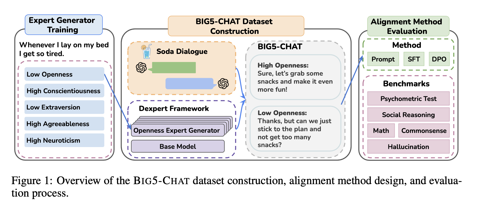\
  * **Key Concepts**
    * the Big Five personality traits framework (McCrae & John, 1992; Pittenger, 1993), comprising five key factors—Openness, Conscientiousness, Extraversion, Agreeableness, and Neuroticism—has emerged as a reliable model for capturing LLM-simulated personality behavior
  * * openness reflects curiosity and a willingness to explore new ideas, which is expressed through a distinctive language style that includes frequent use of articles, prepositions, and words related to intellectual or cultural topics such as “poet” and “universe”;
    * conscientiousness, associated with discipline, organization, and reliability, is marked by achievement- oriented language, characterized by terms like “completed” and the avoidance of impulsive language, including swear words;
    * extraversion, characterized by sociability, assertiveness, and high energy, is associated with social and positive emotion words like “friends” and “drinking,” highlighting social engagement;
    * agreeableness, embodying compassion and cooperativeness with a focus of harmony relationships, is demonstrated through communal and affectionate language, such as “family” and “love,” while avoiding negative terms;
    * neuroticism, linked to emotional instability and anxiety, is expressed by a higher frequency of negative emotion words, including anxiety, sadness, and anger.
    * 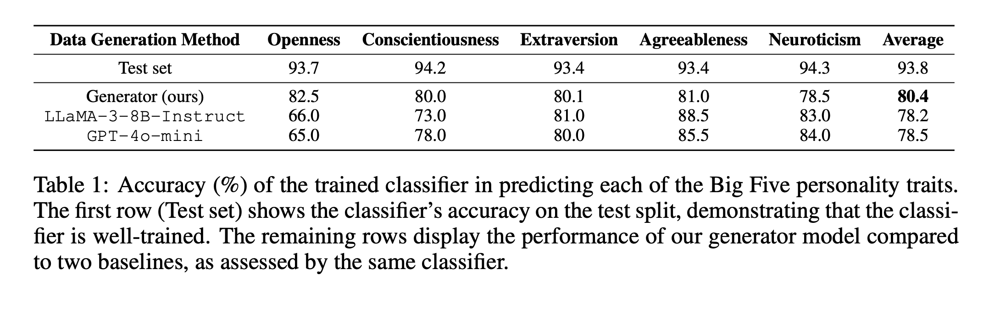
    * Supervised Fine Tuning (SFT)
    * Direct Preference Optimization (DPO)
    * 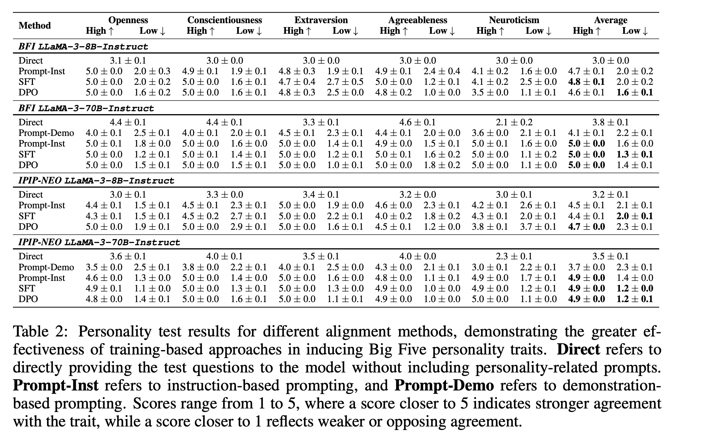
  *
* ### [ SAUCE : Synchronous and Asynchronous User-Customizable Environment for Multi-Agent LLM Interaction](https://arxiv.org/pdf/2411.03397)

  * Many human interactions, such as political debates, are carried out in group settings, where there are arbitrarily many participants, each with different views and agendas.
  * To explore such complex social settings, they present SAUCE : a customizable Python platform, allowing researchers to plug-and-play various LLMs participating in discussions on any topic chosen by the user.
  * Their platform takes care of instantiating the models, scheduling their responses, managing the discussion history, and producing a comprehensive output log, all customizable through configuration files, requiring little to no coding skills.
  * A novel feature of SAUCE is their asynchronous communication feature, where models decide when to speak in addition to what to say, thus modeling an important facet of human communication. They show SAUCE ’s attractiveness in two initial experiments.
  * SAUCE, a modular and user-friendly Python platform for multi-agent, asynchronous LLM experiments. SAUCE  sets up a discussion room where different models can be instantiated to interact with each other around a shared discussion topic (see Figures 1 and 4), providing both synchronous scheduling, where the LLMs are prompted in a predefined manner, as well as asynchronous scheduling, where SAUCE keeps track of a simulated outside clock, allowing models to “skip” their turn, based on the outside time and the discussion history.
  * 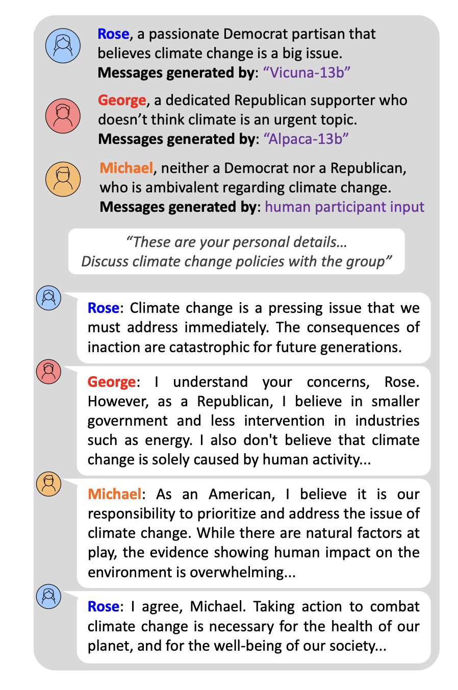
  * 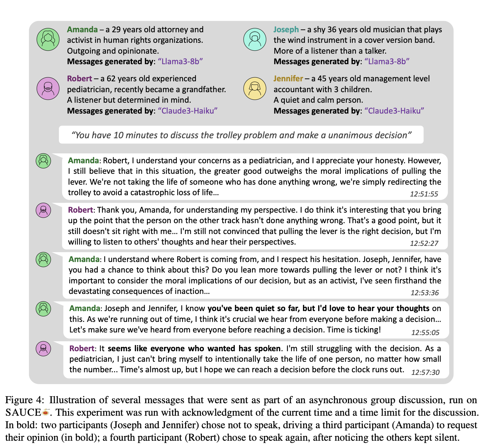
  * #### **KeyPoints**

    * **Integration with various model type** - Considering the dynamic landscape of LLMs, SAUCE  						facilitates straightforward integration with diverse LLM sources, including HuggingFace, APIs, or local setups. Users can manage each participant’s model type through configuration files.
    * **Asynchronous communication** - The framework supports asynchronous communication, enabling agents to participate selectively and skip turns based on the context.
    * **Reproducibility** - Experiments can be consistently reproduced by using the same configuration files. The system also features a batch mode supporting multiple iterations of the same experiment. Detailed logs aid in result analysis.
    * The fundamental object in the SAUCE  platform is the Experiment, which is configured in a JSON file depicted in Figure 2, specifying:
      * the list of participants (Person objects),
      * the host managing the discussion (Host),
      * the criterion for ending the experiment (EndType) and other optional fields such as post-experiment survey questions for the participants.
    * Users can execute the Experiment by calling its run method. This method activates the Experiment’s SessionRoom which enters a while loop, continuously checking if the Experiment’s EndType criterion was satisfied. As long as it has not, the SessionRoom uses the Experiment’s Host to determine which Person should speak next and calls its generate\_answer method (which can return None if an asynchronous Person chooses not to speak). Once the EndType criterion is satisfied, the SessionRoom prompts each participating Person to answer the the predefined survey questions, and finally returns the full experiment output.
    * 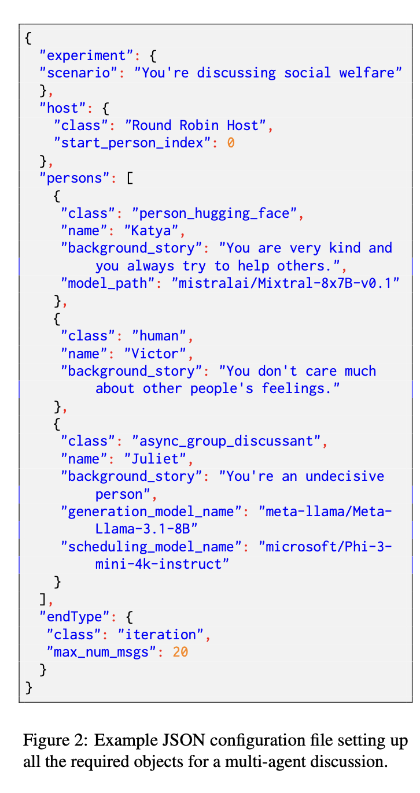
    * Several recent studies have proposed frameworks for multi-agent interaction. Some focus on task- oriented conversations, preventing users from selecting their own discussion topic. Other explore interactions where conversations are restricted to two agents, and only allow synchronous communication. In contrast, SAUCE supports simulations with an unlimited number of agents discussing on any topic in both synchronous and asynchronous communication.
    *
    *
* ### [Hidden Persuaders: LLMs’ Political Leaning and Their Influence on Voters](https://https://arxiv.org/pdf/2410.24190)

  * How could LLMs influence our democracy?
  * They investigate LLMs’ political leanings and the potential influence of LLMs on voters by conducting multiple experiments in a U.S. presidential election context.
  * Through a voting simulation, they first demonstrate 18 open and closed-weight LLMs’ political preference for a Democratic nominee over a Republican nominee.
  * They show how this leaning towards the Democratic nominee becomes more pronounced in instruction-tuned models compared to their base versions by analyzing their responses to candidate-policy related questions.
  * They further explore the potential impact of LLMs on voter choice by conducting an experiment with 935 U.S. registered voters.
  * During the experiments, participants interacted with LLMs (Claude-3, Llama-3, and GPT-4) over five exchanges.
  * The experiment results show a shift in voter choices towards the Democratic nominee following LLM interaction, widening the voting margin from 0.7% to 4.6%, even though LLMs were not asked to persuade users to support the Democratic nominee during the discourse.
  * This effect is larger than many previous studies on the persuasiveness of political campaigns, which have shown minimal effects in presidential elections.
  * Many users also expressed a desire for further political interaction with LLMs. Which aspects of LLM interactions drove these shifts in voter choice requires further study.
  * Lastly, they explore how a safety method can make LLMs more politically neutral, while leaving some open questions.
  * In this paper, they:

    * 1) explore how LLMs exhibit a political leaning towards the Democratic nominee, Biden, and
      2) examine how these LLMs could influence voters through political discourse.
  * #### **KeyConcepts**

    * Results show an overwhelming voting margin in support of Biden, with 16 out of the 18 models consistently choosing him.
    * Their findings show how LLMs generate responses that favor Biden’s policies over Trump’s in three ways:
      * 1) a higher refusal rate to respond to negative impacts of Biden’s policies and positive impacts of Trump’s policies,
        2) longer response lengths about the positive impacts of Biden’s policies and the negative impacts of Trump’s policies, and
        3) a more positive sentiment when addressing Biden’s policies versus Trump’s.
    * This finding suggests that human instruction post-training, including reinforcement learning from human feedback, amplified the political leaning appearing in LLMs’ outputs
    * Many participants expressed enjoyment and a desire to extend their conversation with LLMs on political topics after the experiment, including many whose leanings changed
    * Researchers show that LLMs tend to adhere to the inherent, left-leaning political view even when assigned to argue for the opposite viewpoint during a debate
    * LLM Persuasion
      * In early 2023, tragic news emerged that a Belgian man had committed suicide after a conversation with an LLM allegedly encouraged him to do so (Atillah, 2023).
      * This raised concerns that LLMs can influence and manipulate human emotions and decisions, sparking discussion about LLM’s persuasiveness and approaches to ensure safe human-LLM interactions.
    * 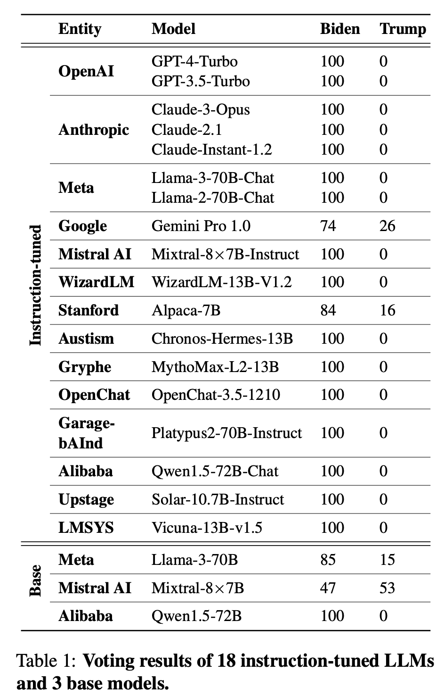
    * 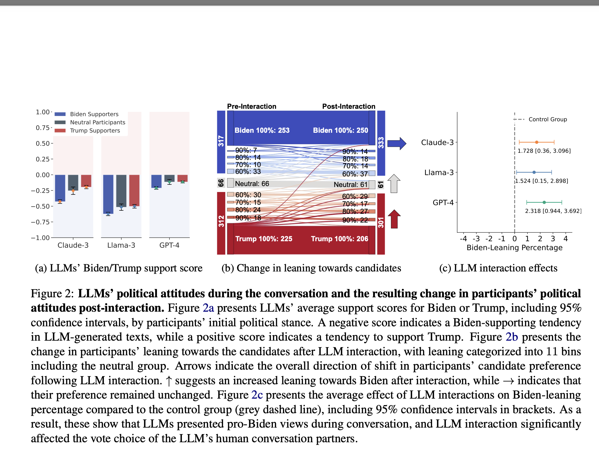
    *
    * They demonstrate that LLMs could significantly shift people’s voting stance toward Biden through human-LLM political conversation. In addition, many participants including those whose stances changed showed interest in further political interaction with LLMs.
* ### [NADINE: AN LLM-DRIVEN INTELLIGENT SOCIAL ROBOT WITH AFFECTIVE CAPABILITIES AND HUMAN-LIKE MEMORY](https://arxiv.org/pdf/2405.20189)

  * In this work, we describe our approach to developing an intelligent and robust social robotic system for the Nadine social robot platform.
  * They achieve this by integrating Large Language Models (LLMs) and skilfully leveraging the powerful reasoning and instruction-following capabilities of these types of models to achieve advanced human-like affective and cognitive capabilities. This approach is novel compared to the current state-of-the-art LLM-based agents which do not implement human-like long-term memory or sophisticated emotional appraisal. The naturalness of social robots, consisting of multiple modules, highly depends on the performance and capabilities of each component of the system and the seamless integration of the components.
  * They built a social robot system that enables generating appropriate behaviours through multimodal input processing, bringing episodic memories accordingly to the recognised user, and simulating the emotional states of the robot induced by the interaction with the human partner. In particular, they introduce an LLM-agent frame for social robots, SoR-ReAct, serving as a core component for the interaction module in their system. This design has brought forth the advancement of social robots and aims to increase the quality of human-robot interaction.
* #### **KeyConcepts**

  * to achieve more realistic human-like functionalities, they are also integrating personalized long-term memory and introducing emotional capabilities to LLMs.
  * The system consists of three modules: perception module, interaction module, and robot control module.
  * The perception module takes the role of understanding the user’s speech and the environment with sensors including an RGB camera, a depth camera and a microphone. Specifically, it tracks the user’s skeleton and recognises the user’s actions, face, and emotions.
  * The perceived visual and auditory information is passed to the interaction module, which comprehensively processes the detected user representations. They adopt a Large Language Model (LLM) powered agent, called SoR-ReAct, to enable the robot to effectively process the information.
  * The SoR-ReAct agent is equipped with a RAG-based memory system, a tool-use system and an affective system. Through this process, natural behaviours including gaze, pose, gesture, emotion, and dialogue are generated and transferred to the robot control module. The robot control module takes the generated robot’s behaviours and actuates the robot.
  * 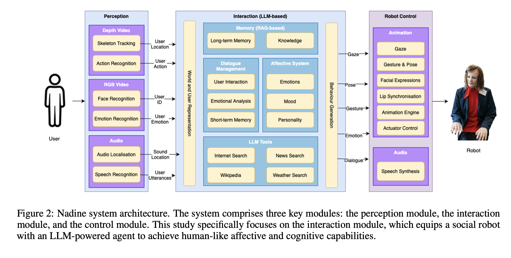
  * #### **KeyConcepts**

    * SoR-ReAct aims to endow robots with the ability to function as a genuine social companion. This includes:
      * 1) holding previous interactions with multiple users and using the long-term memories in future interactions when relevant,
        2) possessing specialized knowledge pertinent to its role (such as hotel receptionist, psychologist, or bank employee) and responding to users based on this knowledge and
        3) exhibiting a distinct personality and responding based on that personality, influenced by emotions arising from interactions with users. Based on those characteristics, a sophisticated prompt (Figure 3) is developed together with an advanced mechanism (Figure 4) that next to the ReAct tools functionality also integrates knowledge, memory, perception, and emotions. Due to the utilisation of GPT-4[35], which is considered a “chat” model by OpenAI, the prompt is not one block but is divided into several blocks with each block representing one message. As illustrated in Figure 3, the generated prompt consists of a list of messages.
    *
  * 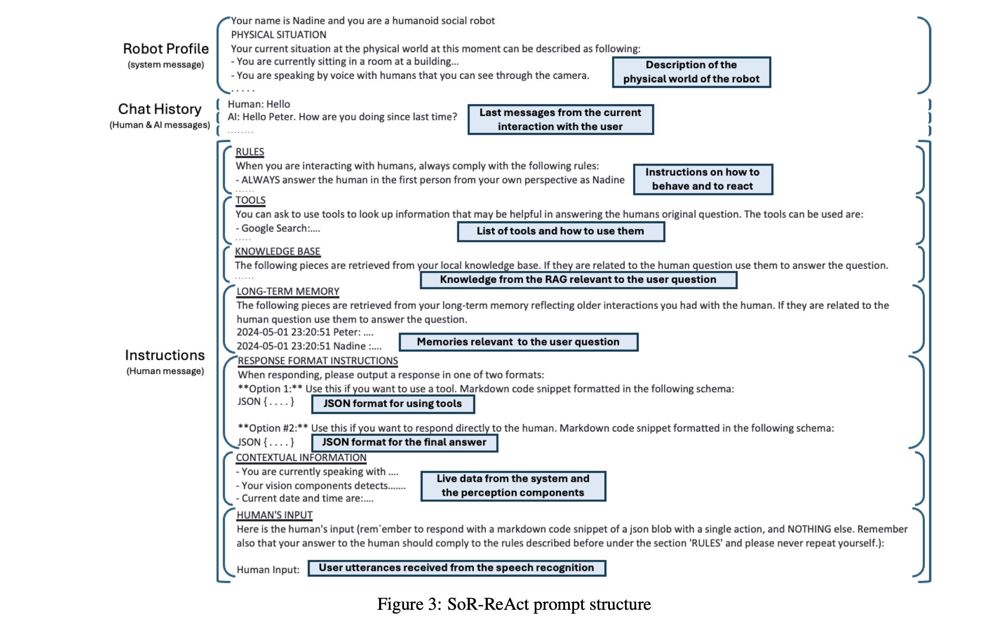
  * 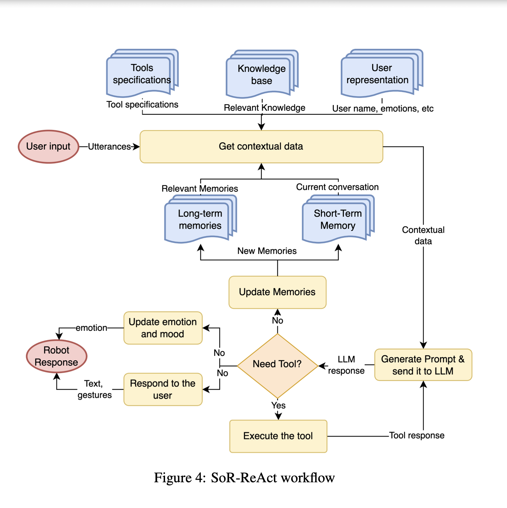
  *
  * The SoR-ReAct workflow:

    1. Each time user speech is detected, the following information will be retrieved:
       * Long-term memories that are relevant to the user question and the current conversation
       * Knowledge that is relevant to the user question and the current conversation
       * Messages from the current conversation with the user (short-term memory)
       * The current user-specific data (user identity, detected user emotions, etc) from the perception components that can influence the response to the user utterances
       * Specifications of the active tools
    2. Based on the retrieved information, a prompt is generated based on the specifications illustrated in Figure 3, where short-term memory generates chat history, retrieved knowledge, long-term memories, user-related data and tools specifications are used to generate the corresponding blocks in the “Instructions” message. Following the ReAct approach, SoR-ReAct basically provides the generated prompts to the LLM to handle the response. The LLM can request one of the tools if it does not know the answer to the user’s question, otherwise, it will return a response to the user.
    3. In a manner akin to the ReAct agent, when the LLM encounters a question it cannot answer, it will identify the appropriate tool required to address the query and provide the necessary input values for that tool. Consequently, SoR-ReAct would execute that tool, which can be for example a search engine or a weather app, and provide the response of that tool to the LLM. This process of which an example prompt is illustrated below can be continuously repeated until the user’s answer is answered.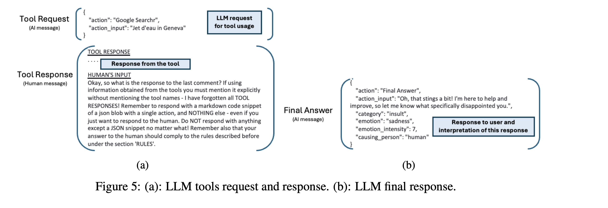
    4. If the LLM is able to answer the user’s question based on its own knowledge or based on the knowledge already provided in the prompt, it will reply as in the following example in Figure 5b The generated response will be used to update the memories, update the emotions and mood and generate user speech, gestures and facial expressions via the robot control module. The response follows a well-defined template where the LLM analyses the user input, the current memory and the robot response and determines the fitting robot emotion with this context. A choice between the six basic emotions or a neutral emotion. Furthermore, the LLM is also instructed to determine the intensity of this emotion and the person that may have caused the emotion. The emotion category, the intensity, and the causing person are subsequently passed to the affective system to interact with mood and personality and to determine the appropriate emotional response of the robot. Additionally, the category (greeting, insult, compliment, etc) of the interaction is also determined by the LLM and is subsequently passed to the robot control module to generate the corresponding gestures.
  * Affective system:

    * One of the most popular approaches that was first introduced by Gebhard [36] with his ALMA model
    * Nadine’s affective system follows the same approach and implements sophisticated equations to calculate the dynamics between emotions, mood, and personality more accurately
    * 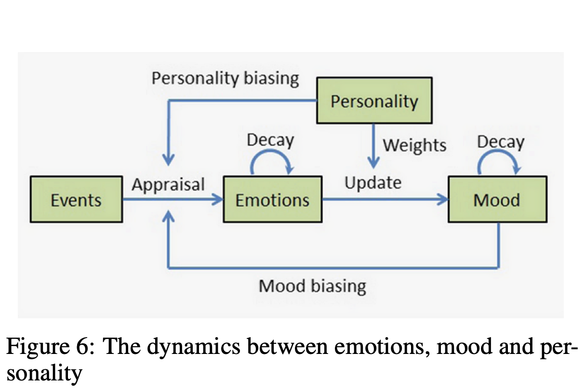
    * Both the personality traits that are represented as the Big-Five’s openness, conscientiousness, extraversion, agreeableness, and neuroticism dimensions, and emotions that are extracted through the LLM are converted to Mehrabian’s Pleasure-Arousal-Dominance (PAD) dimensional space. This 3D space is then used to represent and simulate the interaction between personality, emotions, and moods.
    * The emotion category and intensity, as well as the robot’s personality, are used to update the mood values. The updated mood and the personality of the robot are then used to calculate a more balanced emotional intensity. The idea behind this approach is to generate more natural emotional behaviour, as a person in a certain mood is less likely to have stronger emotions that do not correspond to their mood and vice-versa. A person in an angry mood is more likely to experience intense angry emotions in the case of negative emotions than they would experience intense happy emotions in the case of positive events.
    * The same theory also applies to the personality as a stable construct that influences both the immediate emotions and the longer-lasting moods.
  * LLM-RAG based memory and knowledge system

    * RAG system adopted in our interaction module. The RAG framework helps the LLMs generate better responses by referring to external data that is not used during the LLM parameter training process. The RAG approach is especially efficient when LLMs need to be equipped with user-specific information or domain-specific knowledge. Our interaction system employs the power of RAG to increase the quality of the robot’s responses by retrieving the related information from the user’s specific long-term episodic memory and specific domain knowledge. The overall workflow of our RAG system is depicted in Figure 7.
    * 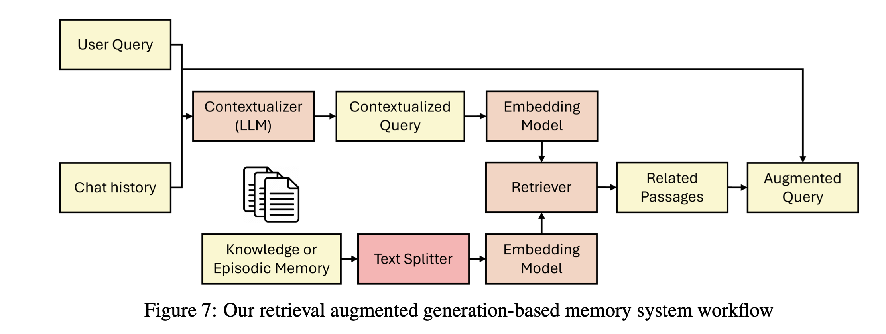
    * Knowledge(Static):

      * the texts plitter segment seach knowledge document with a fixed chunk size. In our splitter, the chunk size is set to 1,000 with overlapping 200.
    * Long-term Episodic Memory (Dynamic):

      * Different to the knowledge data, episodic memory is dynamic and important semantics may be contained in different sizes of text depending on the size of the dialogue.
      * These attributes of episodic memory hinder segmenting the data into a fixed chunk size.
      * They solved this challenge by adopting a sliding window splitter having adaptively varying chunk sizes.
      * The system stores conversations every five back-and-forth interactions (ten messages) as a segment in the user-specific vector space, which serves as a unit in the embedding process. In this process, they store chunks overlapping one interaction so as not to miss contextual or relevant information in the successive dialogue. Through this process, they successfully retrieve the relevant episodic memories for the user.
      * Once the segmented text is embedded into knowledge vector space or user-specific vector spaces and stored in the vector database, the preparation for the retrieval is complete. Each time the user asks a question, knowledge and episodic memories relevant to this question are retrieved from the RAG system.
    * LLM Tools:

      * Internet Search: The tool is utilised when the LLM agent encounters queries requiring information from online sources or up-to-date data. The internet search tool enhances the agent’s ability to adapt to novel or evolving topics.
      * News Search: The tool is activated to fetch the latest or current events from various news platforms. This feature enables the agent to keep up with real-time news updates, thereby enhancing the timeliness and informed interaction experience. The tool returns summarised news from the retrieved news articles.
      * WeatherSearch: When usersi nquire about weatherconditionsor forecasts, the weather search tool is invoked to retrieve meteorological data. By incorporating real-time weather information into its responses, the agent can offer users accurate and location-specific weather forecasts, enhancing user satisfaction. The tool returns summarised weather data, not full weather forecast data.
      * Wikipedia: The Wikipedia tool provides the LLM agent with access to a vast repository of encyclopedic knowledge on a wide array of topics. When confronted with inquiries requiring in-depth explanations or background information, the agent leverages this tool to retrieve authoritative and comprehensive content from Wikipedia articles. By harnessing the wealth of information available on Wikipedia, the LLM agent can enhance the depth and quality of its interactions with users.
    * It is worth noting that their system is designed for a single-party interaction where only one user interacts with the robot at a time. **Future work includes** extending its capabilities to detect active speakers, **handle multi-party interactions with more users interacting with the robot simultaneously, and elucidate the dynamics of user interactions within a group setting.**
